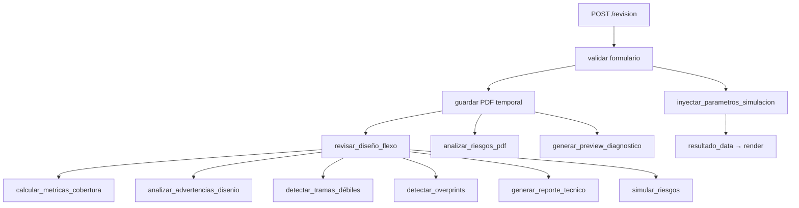
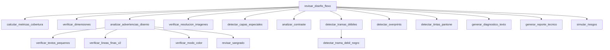
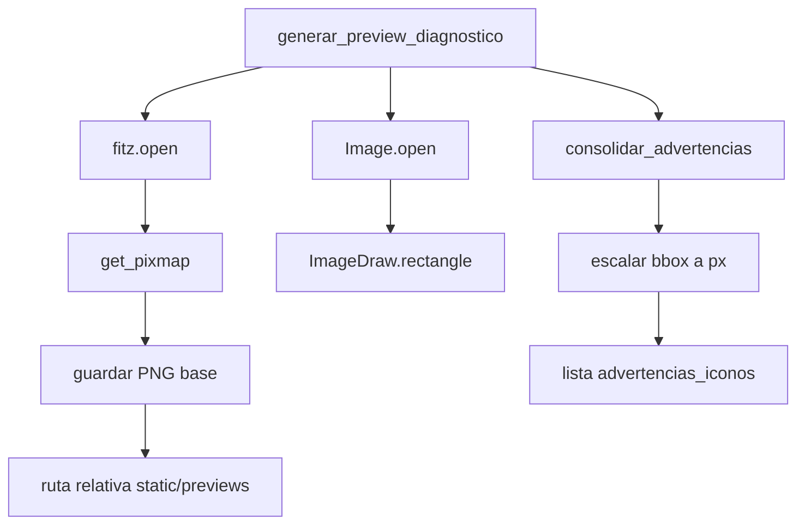
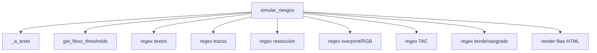
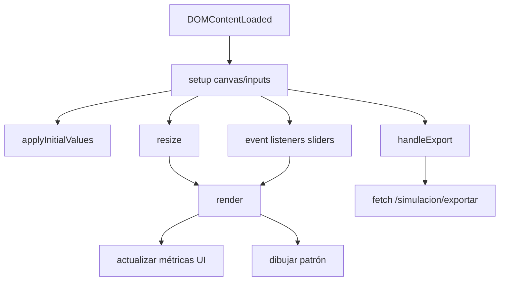
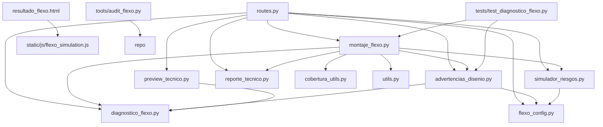

# Mapas de llamadas y dependencias – Diagnóstico Flexo

## 1. Call graphs principales

### `routes.py::revision`

### `montaje_flexo.py::revisar_diseño_flexo`

### `diagnostico_flexo.py::generar_preview_diagnostico`

### `simulador_riesgos.py::simular_riesgos`

### `static/js/flexo_simulation.js`

## 2. Dependencias entre archivos

*Las flechas indican “importa a / utiliza”.*

