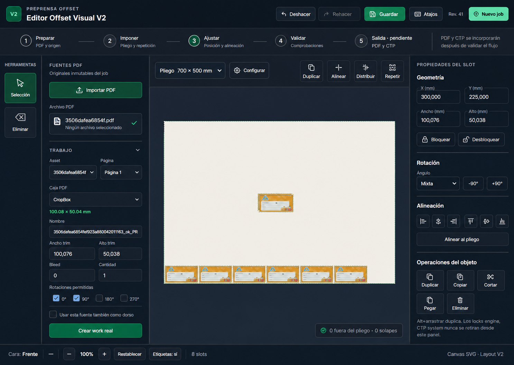

# Plan y trazabilidad del rediseño UX incremental del Editor Offset Visual V2

## 1. Estado y propósito

Fecha de creación: 2026-09-05.

Rama de trabajo prevista:

    codex/editor-offset-v2-ux-foundation

Estado actual del documento: plan y dirección visual aprobados por el usuario el 2026-09-05; Fases 19-A, 19-B y 19-C completadas. STAB-001 a STAB-006 y los fundamentos visuales quedaron validados. El siguiente bloque previsto es la Fase 19-D de jerarquía y organización funcional.

Este documento define cómo mejorar la usabilidad y la organización visual del Editor Offset Visual V2 sin reescribir el editor ni adelantar funciones productivas que todavía no existen.

Sus objetivos son:

- conservar un mapa actualizado entre interfaz, JavaScript, backend, persistencia y pruebas;
- registrar las decisiones tomadas antes y durante el rediseño;
- separar mejoras visuales, cambios funcionales y trabajo productivo futuro;
- evitar que una reorganización de HTML o CSS rompa IDs, listeners, comandos, autosave o contratos;
- definir fases pequeñas, reversibles y verificables;
- establecer qué debe documentarse después de cada cambio;
- dejar preparada la interfaz para preview, PDF y CTP sin declarar esas capacidades como operativas.

Este documento es un plan vivo de fase. No reemplaza el estado operativo registrado en:

- 18_ESTADO_ACTUAL_POST_EXPLORACIONES_1_A_4_V2.md;
- 01_CONTRATO_LAYOUT_V2.md;
- 02_KERNEL_GEOMETRICO_V2.md;
- 03_ADAPTADOR_SALIDA_V2.md;
- 11_DECISIONES_ARQUITECTONICAS_PENDIENTES_V2.md.

El documento 18 debe conservarse como fotografía histórica previa al rediseño. Este documento 19 registrará la evolución de la fase. Cuando la fase termine y haya sido validada, deberá redactarse un nuevo estado operativo posterior al rediseño.

## 2. Evidencia utilizada

### Confirmado por ejecución y documentación operativa

- cuatro exploraciones interactivas registradas en el documento 18;
- editor funcionando con un job real, un asset, un work y ocho slots;
- persistencia, revisión optimista, undo/redo, autosave y recarga operativos en los recorridos explorados;
- herramientas principales de selección, drag, Repeat, clipboard, alineación, matriz, reglas, guías, snap y medición presentes;
- problemas reproducidos en nudge, eliminación con dependencias, matriz, estados temporales y recuperación de conflicto;
- incomodidad responsive observada alrededor de 1050 px y 820 px;
- ausencia de preview productivo V2, PDF final V2, CTP productivo V2 y preflight final.

### Confirmado por código

- la estructura visual vive principalmente en templates/editor_offset_visual_v2.html;
- el contrato de referencias DOM está centralizado en static/js/editor_offset_v2/dom_refs.js;
- la composición principal y los listeners de alto nivel viven en static/js/editor_offset_v2/bootstrap.js;
- el canvas y parte del inspector son renderizados por static/js/editor_offset_v2/canvas_renderer.js;
- los paneles especializados conservan responsabilidades separadas;
- el layout de escritorio usa cuatro columnas en static/css/editor_offset_visual_v2.css;
- existen reglas responsive específicas para 1050 px y 820 px;
- JobService crea actualmente pliegos de 700 x 500 mm con márgenes imprimibles en cero;
- POST /api/editor-offset-v2/jobs acepta actualmente solo el campo opcional name;
- el botón Nuevo job crea el job directamente y navega a su URL, sin un paso de configuración;
- Layout V2 ya contiene sheet.size_mm y sheet.printable_margins_mm.

### Confirmado por validación automatizada posterior

- las exploraciones originales no ejecutaron suites, pero las Fases 19-A a 19-C incorporaron y ejecutaron regresiones específicas;
- todos los tests de tests/editor_offset_v2 pasaron: 331 passed y 1 skipped;
- todos los tests JavaScript V2 pasaron: 108 passed;
- los dos archivos Playwright V2 pasaron: 17 passed;
- existe una caracterización específica para los fundamentos visuales en 1487, 1050 y 820 px;
- la dirección visual aprobada fue comparada con la implementación HTML/CSS real;
- no se ejecutó la suite completa de todo el repositorio, fuera de la superficie V2 indicada.

## 3. Decisión principal del rediseño

El rediseño será incremental y utilizará el editor actual como base.

No se construirá una interfaz nueva desde cero. Se conservarán:

- la aplicación Flask actual;
- el template V2 actual;
- el canvas SVG actual;
- los módulos JavaScript actuales;
- el store y el command system;
- undo y redo;
- autosave y control de revisión;
- selección, drag y Alt+drag;
- Repeat y herramientas manuales;
- assets, works y slots;
- los contratos de Layout V2;
- las rutas públicas V2;
- el aislamiento respecto de V1.

La mejora se concentrará en jerarquía, agrupación, legibilidad, descubrimiento de herramientas, estados, configuración del pliego y adaptación responsive.

## 4. Referencias visuales

### Estado actual usado como base

Captura real principal:

    output/playwright/v2-fourth-exploration-20260904/01-baseline.png

Otras evidencias visuales:

    output/playwright/v2-baseline-20260830/
    output/playwright/v2-second-exploration-20260903/
    output/playwright/v2-third-exploration-20260903/
    output/playwright/v2-fourth-exploration-20260904/

### Propuesta visual incremental

Archivo conservado con esta documentación:

    DOCS/OFFSET/V2/assets/19_propuesta_visual_redisenio_incremental_v2.png

Vista:

La imagen es una referencia de dirección visual, no una especificación ejecutable ni una prueba de funcionamiento.

Si la imagen contiene textos aproximados, iconos ilustrativos o controles aún inexistentes, prevalecen las decisiones y restricciones escritas en este documento.

## 5. Objetivo del producto

El operador debe poder comprender y ejecutar el flujo principal del montaje sin recorrer un inspector de varios miles de píxeles ni buscar las acciones más importantes entre controles secundarios.

Flujo de producto propuesto:

    Preparar -> Imponer -> Ajustar -> Validar -> Salida

Significado:

1. Preparar: crear job, configurar pliego, importar PDF y definir work.
2. Imponer: configurar y aplicar Repeat; en el futuro podrá alojar otros motores si se implementan.
3. Ajustar: seleccionar, mover, duplicar, alinear, distribuir, medir y editar propiedades.
4. Validar: reunir avisos geométricos y, en el futuro, el preflight productivo.
5. Salida: alojar preview, PDF y CTP cuando existan realmente.

Los pasos representan una jerarquía de trabajo. No deben presentarse todos como funciones completas si su backend todavía no existe.

## 6. Criterios de éxito

El rediseño se considerará exitoso cuando:

- el editor siga abriendo los mismos jobs V2;
- el layout persistido conserve el mismo contrato;
- todas las herramientas existentes continúen siendo alcanzables;
- las acciones primarias sean visibles sin recorrer todo el inspector;
- la configuración del pliego tenga una ubicación clara;
- el canvas siga siendo la superficie dominante;
- el inspector responda a la selección y muestre primero la información relevante;
- Repeat sea localizable desde la etapa de imposición;
- los avisos geométricos y de compatibilidad tengan revisión y procedencia comprensibles;
- PDF y CTP no aparezcan como operativos antes de su implementación;
- teclado, foco, aria-live y estados disabled continúen funcionando;
- los recorridos críticos no produzcan pageerror ni errores de aplicación en consola;
- 1440 px ofrezca la experiencia principal completa;
- 1050 px y 820 px mantengan accesibles las tareas esenciales mediante una composición decidida, no solo columnas comprimidas;
- undo/redo, autosave, recarga y conflicto sigan siendo correctos después de la reorganización.

## 7. Alcance aprobado para esta fase

### Dentro del alcance

- mejorar tipografía, contraste, espaciado y tamaños de controles;
- reducir densidad visual innecesaria;
- establecer una navegación de flujo comprensible;
- reorganizar las herramientas existentes por tarea;
- conservar o envolver elementos existentes sin cambiar inicialmente sus IDs;
- priorizar importar PDF, configurar pliego, imponer, ajustar y validar;
- hacer contextual el inspector;
- reducir scrolls anidados y bloques siempre abiertos;
- mejorar feedback de selección, revisión, guardado, conflicto y diagnóstico;
- diseñar una configuración de pliego segura;
- mejorar responsive y accesibilidad operativa;
- crear pruebas de caracterización antes de la implementación;
- documentar cada cambio real y su validación.

### Fuera del alcance

- preview productivo V2;
- generación PDF final V2;
- producción CTP V2;
- preflight PDF profundo;
- motor PDF nativo V2;
- Nesting o Hybrid V2;
- dúplex productivo y navegación completa front/back;
- resize;
- transformaciones internas del artwork;
- rotación libre;
- cambio de Layout Schema Version;
- refactor masivo de JavaScript;
- migración a framework frontend, TypeScript o bundler;
- cambios en V1;
- conexión directa a montaje_offset_inteligente.py;
- cambios oportunistas en engines/step_repeat_pro_engine.py.

Estas exclusiones no impiden reservar lugares comprensibles para capacidades futuras. Impiden presentarlas como terminadas o mezclarlas con la fase UX.

## 8. Jerarquía visual objetivo

### Encabezado global

Debe conservar:

- identidad Editor Offset Visual V2;
- nombre e ID del job;
- revisión;
- estado de guardado;
- Deshacer;
- Rehacer;
- Guardar;
- Atajos;
- Nuevo job;
- recuperación de conflicto cuando corresponda.

Mejora prevista:

- separar información del job de acciones globales;
- hacer Guardar y Nuevo job distinguibles sin competir entre sí;
- mostrar conflictos y cambios sin guardar con mensajes comprensibles;
- evitar que datos esenciales desaparezcan sin alternativa responsive.

### Navegación de flujo

Se propone una franja compacta con:

- Preparar;
- Imponer;
- Ajustar;
- Validar;
- Salida.

Esta franja no debe cambiar automáticamente el layout persistido. Su primera implementación puede controlar únicamente qué grupo de herramientas está visible.

El estado activo debe ser temporal y no necesita formar parte de Layout V2 salvo decisión posterior explícita.

### Herramientas laterales

Debe conservar las herramientas actuales, especialmente Selección, creación de slot cuando corresponda y Eliminación.

Mejora prevista:

- targets mayores;
- etiquetas legibles;
- estados activos y disabled inequívocos;
- tooltips o ayudas breves para acciones no evidentes;
- no duplicar acciones destructivas en varios lugares sin una jerarquía clara.

### Panel de preparación

Debe reunir:

- assets PDF;
- carga de PDF;
- selección de página y caja;
- metadata de medida;
- creación de work;
- cantidad y rotaciones permitidas;
- creación de slot y sustitución de fuente cuando corresponda.

Mejora prevista:

- distinguir fuente PDF de work lógico;
- ordenar los campos por dependencia;
- evitar que la lista de slots desplace las tareas primarias;
- mostrar errores de upload y validación junto al control que los originó.

### Canvas

Debe seguir siendo la mayor superficie visible.

Debe conservar:

- SVG del pliego;
- slots y artwork aproximado;
- selección;
- drag;
- marquee;
- pan y zoom;
- reglas, guías, snap y medición;
- estados fuera de pliego, fuera de imprimible y overlap;
- etiquetas temporales.

Mejora prevista:

- mostrar el tamaño del pliego junto al canvas;
- acercar acciones frecuentes como duplicar, alinear, distribuir y Repeat sin ocultar el pliego;
- mostrar un resumen geométrico compacto;
- no convertir el canvas en un dashboard.

### Inspector contextual

El inspector actual contiene operaciones de objeto, posición, alineación, precisión, selección, árbol, Repeat y output en una sola columna larga.

La propuesta separa esas responsabilidades por contexto:

- selección de slot: geometría, rotación, locks y operaciones;
- selección múltiple: alineación, distribución y gaps;
- imposición: Repeat;
- precisión: reglas, guías, snap y medición;
- objetos: árbol, filtros y visibilidad;
- validación: problemas geométricos y output-capabilities;
- salida: estado pendiente hasta que exista implementación productiva.

No se eliminarán paneles existentes para simplificar visualmente. Primero se hará un inventario de cada control y su consumidor.

### Barra de estado

Debe conservar:

- cara activa;
- cursor cuando corresponda;
- zoom;
- restablecer vista;
- etiquetas;
- cantidad de slots;
- mensajes globales.

Mejora prevista:

- distinguir estado persistente, estado temporal y feedback de herramienta;
- evitar que un mensaje de medición o diagnóstico antiguo parezca vigente;
- mantener información crítica visible en responsive.

## 9. Mapa de conexiones de la interfaz

| Superficie | HTML actual | JavaScript principal | Estado o contrato relacionado | Riesgo al moverla |
| --- | --- | --- | --- | --- |
| Job y acciones globales | ev2-job-name, ev2-job-id, ev2-revision, ev2-save, ev2-new-job | bootstrap.js, autosave.js | revision, cambios locales, conflicto | Alto |
| Herramienta de selección | ev2-select-tool | bootstrap.js, interactions.js, command_registry.js | selección temporal y pointer sessions | Alto |
| Eliminación | ev2-delete-slots, ev2-object-delete | command_registry.js, commands.js, edit_policy.js | locks y generated_by.source_slot_id | Alto |
| Upload PDF | ev2-asset-upload-form y controles ev2-asset-* | assets_panel.js, api_client.js | assets inmutables, revisión, archivos físicos | Alto |
| Creación de work | controles ev2-work-* | assets_panel.js, commands.js | works, fuentes, trim, bleed, cantidad | Alto |
| Canvas | ev2-canvas | canvas_renderer.js, interactions.js, geometry_view.js | Layout V2, coordenadas, selección, viewport | Alto |
| Operaciones de objeto | controles ev2-object-* | objects_panel.js, command_registry.js, object_operations.js | comandos, clipboard, locks | Alto |
| Posición precisa | controles ev2-position-* | position_inspector.js, nudge_controller.js | centro trim, selección, historial | Alto |
| Alineación y matriz | controles ev2-arrangement-* | arrangement_panel.js, alignment_operations.js | selección, slot clave, comandos | Alto |
| Precisión | controles ev2-precision-* | precision_panel.js, precision_tools.js, snap_engine.js | estado temporal, geometría | Moderado |
| Selección avanzada y árbol | ev2-object-tree y controles relacionados | advanced_selection.js, object_tree.js | selección y visibilidad temporal | Moderado |
| Repeat | controles ev2-repeat-* | repeat_panel.js, api_client.js | propuesta temporal, base_revision, ApplyRepeatCommand | Alto |
| Compatibilidad de salida | controles ev2-output-* | output_panel.js, api_client.js | revisión persistida analizada | Alto |
| Barra de estado | ev2-active-face, ev2-zoom, ev2-slot-count, ev2-status-message | canvas_renderer.js, bootstrap.js, varios paneles | mezcla de estados globales y temporales | Moderado |

## 10. Contratos que deben preservarse

### Contrato Layout V2

No cambiar durante las fases puramente visuales:

- layout_schema_version = 2;
- milímetros;
- origen inferior izquierdo;
- centro trim como posición persistida;
- rotaciones cardinales;
- bleed separado;
- referencias entre assets, páginas, cajas, works y slots;
- IDs únicos;
- generated_by;
- locks;
- revisión optimista;
- estado temporal fuera del layout.

### Contrato DOM

Regla inicial:

- conservar IDs ev2-* existentes;
- conservar data attributes funcionales;
- conservar names de radio buttons y formularios;
- conservar relaciones label/for;
- conservar aria-live y role;
- conservar los elementos requeridos por DomRefs.collect();
- no duplicar un mismo ID al mostrar una herramienta en otra región;
- si una acción necesita dos accesos visuales, ambos deben delegar en la misma acción del command registry.

Antes de renombrar o retirar cualquier control se debe buscar:

- referencia en dom_refs.js;
- listener en bootstrap.js o paneles;
- uso en render;
- uso en tests Node;
- uso en Playwright;
- dependencia de accesibilidad o foco.

### Contrato de acciones

Las nuevas superficies visuales no deben implementar mutaciones paralelas.

Las acciones deben seguir pasando por:

- command_registry.js cuando exista una acción registrada;
- commands.js para mutaciones reversibles;
- store.executeCommand() para historial;
- edit_policy.js para locks;
- autosave para persistencia;
- api_client.js para comunicación HTTP.

## 11. Configuración del pliego

### Estado actual confirmado

- el job se crea directamente desde Nuevo job;
- el frontend envía un body vacío o solo name;
- el endpoint de creación rechaza campos distintos de name;
- JobService inicializa sheet.size_mm en 700 x 500 mm;
- JobService inicializa los cuatro márgenes imprimibles en 0 mm;
- el contrato Layout V2 ya posee tamaño y márgenes;
- no existe actualmente un control de interfaz para configurarlos.

### Resultado deseado

El operador debe poder:

- seleccionar un formato predefinido o ingresar ancho y alto;
- elegir orientación sin perder la medida original;
- configurar márgenes imprimibles;
- ver una vista previa del área útil;
- conocer cuántos slots quedarían fuera del pliego o del área imprimible;
- confirmar el cambio de forma explícita cuando ya existan slots.

### Política SAFE propuesta

- no escalar automáticamente works, slots ni artwork;
- no mover automáticamente slots existentes sin una acción explícita posterior;
- validar ancho y alto mayores que cero;
- impedir márgenes negativos;
- impedir que izquierda + derecha alcance o supere el ancho;
- impedir que inferior + superior alcance o supere el alto;
- recalcular geometría visual después del cambio;
- invalidar o marcar pendiente output-capabilities al cambiar la revisión;
- aplicar el cambio mediante un comando reversible;
- incluirlo en undo/redo y autosave;
- mantener compatibilidad con jobs existentes;
- conservar 700 x 500 mm como fallback mientras no se apruebe otra política.

### Decisiones todavía abiertas

1. ¿La configuración debe ocurrir antes de crear el job o inmediatamente después?
2. ¿Se permitirá modificar el pliego cuando existan slots fuera de bounds?
3. ¿La confirmación mostrará solo conteos o una lista de slots afectados?
4. ¿Los presets pertenecerán al frontend, a configuración global o al layout?
5. ¿Se guardará el último formato usado por operador?
6. ¿Un cambio de orientación intercambia ancho y alto o usa presets separados?

### Impacto probable

Frontend:

- templates/editor_offset_visual_v2.html;
- static/css/editor_offset_visual_v2.css;
- static/js/editor_offset_v2/dom_refs.js;
- static/js/editor_offset_v2/bootstrap.js;
- static/js/editor_offset_v2/commands.js;
- static/js/editor_offset_v2/command_registry.js;
- static/js/editor_offset_v2/canvas_renderer.js;
- posiblemente un nuevo módulo específico para el panel de pliego.

Backend, solo si se configura antes de crear el job:

- editor_offset_v2/blueprint.py;
- editor_offset_v2/application/job_service.py;
- tests del servicio y del endpoint.

El cambio puede ser aditivo dentro de Layout V2 porque los campos ya existen. Esto es una inferencia de planificación, no una autorización para cambiar el endpoint ni una decisión definitiva sobre versionado.

## 12. PDF, validación y CTP futuros

### Situación actual

- output-capabilities es un diagnóstico limitado;
- no es preview;
- no genera PDF;
- no es preflight final;
- no valida todos los problemas geométricos;
- no existe producción CTP V2;
- el adaptador temporal no equivale a un motor de salida completo.

### Representación permitida durante el rediseño

La interfaz puede mostrar:

- una etapa Validar;
- el diagnóstico output-capabilities con revisión analizada;
- problemas geométricos ya calculados por el frontend;
- una etapa Salida marcada como pendiente;
- texto informativo indicando que PDF y CTP se incorporarán después.

La interfaz no debe mostrar como operativos:

- Generar PDF;
- Preview productivo;
- Enviar a CTP;
- Trabajo listo para imprenta;
- preflight aprobado;
- dúplex validado.

### Regla de ramas futuras

Después de estabilizar y cerrar la base UX, las capacidades productivas deben trabajarse en ramas independientes, por ejemplo:

    codex/editor-offset-v2-pdf-output
    codex/editor-offset-v2-ctp-production

Los nombres son propuestas y no crean esas ramas.

## 13. Plan SAFE por fases

### Fase 19-0: documentación y baseline visual

Estado: completada y aprobada el 2026-09-05.

Objetivos:

- conservar la propuesta visual;
- registrar decisiones, alcance y no objetivos;
- mapear controles actuales y consumidores;
- establecer la matriz inicial de trazabilidad.

Cambios permitidos:

- documentación y recursos visuales de documentación.

Gate de salida:

- documento 19 revisado;
- propuesta visual aceptada o refinada;
- ninguna modificación de código mezclada.

### Fase 19-A: caracterización previa

Estado: caracterización prioritaria completada el 2026-09-05. La tanda interactiva y cinco regresiones automatizadas focalizadas reproducen STAB-001 a STAB-005; no se ejecutó la suite completa.

Objetivos:

- congelar el comportamiento actual antes de mover la interfaz;
- capturar errores JavaScript además del resultado funcional;
- establecer screenshots comparables en estados representativos.

Cobertura focalizada:

- creación de job;
- upload y creación de work;
- creación de slot y Repeat;
- selección, drag y Alt+drag;
- undo/redo/autosave/recarga;
- locks;
- nudge sin pageerror;
- delete con dependientes;
- matriz y segundo submit;
- conflicto 409;
- invalidación del diagnóstico de salida;
- responsive en 1440, 1050 y 820 px;
- consola limpia en recorridos críticos.

#### Resultado 19-A.1: primera tanda interactiva

Fecha: 2026-09-05.

Entorno:

- Flask V2 comprobado con editor-offset-local-qa;
- GET / y GET /editor_offset_visual_v2 respondieron HTTP 200;
- V2 activo y herramientas de desarrollo desactivadas según el proceso controlado;
- navegador real controlado con Playwright CLI;
- sesión aislada v2-redesign-19a;
- job de caracterización ev2_14d0c6f8f60e601aed51f833;
- no se ejecutó pytest, Node ni la suite Playwright existente;
- no se modificó código de producción ni se crearon todavía archivos de test.

Resultados confirmados:

1. Baseline de 1440 x 1024:
   - el editor abrió con 8 slots, 1 work y 1 asset;
   - la revisión inicial de esta tanda fue 43;
   - el primer load registró únicamente el 404 conocido de favicon;
   - después de la recarga final, la consola quedó con 0 errores y 0 warnings.
2. Responsive de 1050 x 900:
   - assets, canvas e inspector permanecieron presentes;
   - las cuatro columnas quedaron comprimidas;
   - el canvas perdió superficie útil;
   - assets e inspector necesitaron scroll independiente;
   - la densidad y el recorte visual justifican una estrategia responsive específica.
3. Responsive de 820 x 900:
   - el panel de assets dejó de formar parte de la composición visible;
   - el canvas y el inspector permanecieron;
   - el inspector conservó una gran cantidad de controles en una columna estrecha;
   - apareció scroll horizontal interno en el inspector;
   - las tareas de preparar e imponer no quedaron disponibles en la misma vista.
4. Nudge:
   - ArrowRight cambió Centro X de 350.000 a 350.100 mm;
   - se reprodujo TypeError: Illegal invocation en nudge_controller.js:126;
   - el stack pasó por command_registry.js y shortcut_manager.js;
   - undo restauró X a 350.000 mm;
   - el job quedó guardado y alcanzó revisión 45.
5. Delete con dependencia:
   - al eliminar el origen seleccionado, la UI pasó temporalmente de 8 a 7 slots;
   - autosave mostró Error al guardar;
   - el mensaje recibido fue The submitted document is not a valid Layout V2;
   - la revisión persistida no avanzó durante el rechazo;
   - undo restauró 8 slots y guardó revisión 46;
   - la comprobación final encontró 0 referencias source_slot_id rotas.
6. Diagnóstico output-capabilities:
   - se consultó el diagnóstico en revisión 46;
   - informó incompatibilidad en dos grupos de issues;
   - un cambio de posición guardó revisión 47;
   - el panel continuó mostrando No compatible con salida temporal · revisión 46;
   - undo restauró la geometría y guardó revisión 48;
   - una consulta manual posterior actualizó el diagnóstico a revisión 48.
7. Matriz:
   - con 1 slot fuente y matriz 2 x 2 se esperaban 3 slots nuevos;
   - después de aplicar, el layout pasó de 8 a 11 slots y revisión 49;
   - la selección pasó a 3 copias;
   - el mismo formulario cambió su resumen a 3 fuentes y 9 slots nuevos;
   - output-capabilities permaneció asociado a revisión 48;
   - undo restauró 8 slots, 1 fuente seleccionada y revisión 50.
8. Conflicto de revisión:
   - dos pestañas abrieron el mismo job en revisión 50;
   - la primera guardó X 350.200 mm y revisión 51;
   - la segunda intentó guardar X 350.300 mm sobre base 50;
   - la UI mostró Conflicto de revisión;
   - el mensaje técnico fue The submitted base revision does not match the persisted layout;
   - Recargar versión remota recuperó revisión 51;
   - undo en la primera pestaña restauró X 350.000 mm y guardó revisión 52.

Estado final comprobado:

- revisión 52;
- 8 slots;
- 1 work;
- 1 asset;
- 0 referencias source_slot_id rotas;
- slot original en X 350 mm;
- estado Guardado;
- recarga final correcta;
- consola final con 0 errores y 0 warnings;
- Flask V2 continuó respondiendo HTTP 200.

Artefactos:

    output/playwright/v2-redesign-phase-19a-20260905/01-baseline-1440.png
    output/playwright/v2-redesign-phase-19a-20260905/02-responsive-1050.png
    output/playwright/v2-redesign-phase-19a-20260905/03-responsive-820.png
    output/playwright/v2-redesign-phase-19a-20260905/04-nudge-restored.png
    output/playwright/v2-redesign-phase-19a-20260905/05-delete-invalid-local-state.png
    output/playwright/v2-redesign-phase-19a-20260905/06-output-stale-revision.png
    output/playwright/v2-redesign-phase-19a-20260905/07-matrix-selection-risk.png
    output/playwright/v2-redesign-phase-19a-20260905/08-conflict-409.png
    output/playwright/v2-redesign-phase-19a-20260905/09-final-restored-1440.png

Interpretación:

- la primera tanda confirmó los principales hallazgos del documento 18;
- los fallos son anteriores al rediseño y no fueron introducidos por esta rama;
- el estado productivo del job quedó restaurado;
- esta tanda aportó la evidencia necesaria para diseñar regresiones automatizadas estables.

#### Resultado 19-A.2: regresiones automatizadas focalizadas

Fecha: 2026-09-05.

Archivo agregado:

    tests/playwright/test_editor_offset_v2_ux_characterization.py

Alcance:

- servidor Flask V2 temporal por test, con almacenamiento aislado en tmp_path;
- PDF mínimo creado dentro del directorio temporal de cada caso;
- jobs temporales independientes del job usado durante las exploraciones;
- captura de pageerror y errores de consola en cada recorrido;
- exclusión limitada del ruido HTTP 400 y 409 únicamente en los casos que provocan deliberadamente esas respuestas;
- ninguna modificación en HTML, CSS, JavaScript o Python productivo;
- ninguna ejecución de la suite Playwright completa.

Contratos automatizados:

1. STAB-001: una flecha debe mover 0,1 mm sin pageerror.
2. STAB-002: eliminar un origen no debe dejar source_slot_id roto ni terminar en save_error.
3. STAB-003: un diagnóstico de output no debe seguir presentando una revisión anterior como vigente después de guardar un cambio.
4. STAB-004: una doble activación de Crear matriz debe producir una sola operación.
5. STAB-005: un conflicto 409 debe mantener la recuperación visible y explicar la situación en lenguaje del operador, sin exponer como único detalle el mensaje técnico del API.

Estrategia de fallo conocido:

- cada test afirma primero la preparación y los resultados no relacionados con el defecto;
- pytest.xfail se activa dinámicamente solo cuando aparece el síntoma histórico exacto;
- un fallo de infraestructura, un pageerror diferente o un error de consola no previsto continúa siendo un fallo real;
- cuando se corrija un defecto, su test pasará directamente sin conservar una exclusión permanente.

Ejecuciones:

1. Primera ejecución:
   - 3 xfailed y 2 failed;
   - los dos failed correspondieron al mensaje genérico de Chromium para las respuestas HTTP 400 y 409 esperadas por esos escenarios;
   - no se detectó un defecto nuevo;
   - se acotó el filtro a esos estados y únicamente a sus respectivos casos.
2. Ejecución final focalizada:
   - 5 xfailed;
   - exit code 0;
   - duración aproximada: 24,44 segundos;
   - STAB-001 a STAB-005 reproducidos de forma controlada;
   - 5 warnings deprecados procedentes de tipos SWIG de PyMuPDF, sin fallo funcional.

Comando ejecutado:

    venv\Scripts\python.exe -m pytest tests\playwright\test_editor_offset_v2_ux_characterization.py -q -rxX

Conclusión:

- la Fase 19-A queda completada para los cinco defectos prioritarios anteriores al rediseño;
- la suite amplia permanece sin ejecutar y no se considera validada en esta fase;
- el próximo cambio productivo debe limitarse a STAB-001, ejecutar este archivo focalizado y conservar los otros cuatro defectos como xfailed conocidos.

Gate de salida:

- comportamiento actual registrado;
- fallos conocidos reproducidos por tests específicos;
- baselines independientes de IDs aleatorios y timestamps;
- ninguna corrección mezclada con la caracterización.

### Fase 19-B: estabilización mínima

Estado: completada el 2026-09-05. STAB-001 a STAB-006 fueron corregidos y validados de forma incremental antes de iniciar el rediseño.

Orden recomendado:

1. corregir nudge y su batching;
2. aplicar una política aprobada para delete con dependientes;
3. invalidar o marcar obsoleto output-capabilities;
4. proteger la matriz contra el segundo submit accidental;
5. mejorar recuperación de conflicto;
6. sincronizar feedback temporal de clipboard y medición.

#### Resultado 19-B.1: STAB-001 nudge sin pageerror

Fecha: 2026-09-05.

Problema confirmado antes del cambio:

- ArrowRight movía el slot 0,1 mm, pero generaba TypeError: Illegal invocation;
- la regresión STAB-001 reproducía el fallo como xfailed;
- el origen estaba en nudge_controller.js: setTimeout y clearTimeout del navegador se guardaban sin enlazar su receptor global y después se invocaban como métodos del controlador.

Cambio aplicado:

- se enlazaron setTimeout y clearTimeout a globalThis al usar las implementaciones predeterminadas;
- se conservaron sin cambios las funciones inyectables usadas por tests;
- no se modificaron payloads, pasos de 0,1/1/10 mm, batching, comandos, locks, geometría, Layout V2 ni persistencia;
- se amplió STAB-001 para comprobar un único comando de historial, undo, redo, guardado, recarga y ausencia de errores de consola/pageerror.

Archivos modificados:

    static/js/editor_offset_v2/nudge_controller.js
    tests/playwright/test_editor_offset_v2_ux_characterization.py

Validación focalizada:

- node --check de nudge_controller.js: correcto;
- tests unitarios de positioning_commands_v2.test.cjs: 18 passed;
- STAB-001 antes del cambio: 1 xfailed por Illegal invocation;
- STAB-001 después del cambio: 1 passed;
- recorrido Playwright existente de posicionamiento, atajos, batching, persistencia y locks: 1 passed;
- archivo de caracterización completo: 1 passed y 4 xfailed conocidos;
- STAB-002 a STAB-005 conservaron exactamente sus síntomas caracterizados;
- warnings observados: tipos SWIG de PyMuPDF deprecados, sin fallo funcional;
- suite completa no ejecutada.

Resultado:

- STAB-001 queda corregido y protegido por prueba de navegador real;
- el movimiento con flechas mantiene 0,1 mm, undo/redo y persistencia después de recargar;
- no se detectaron regresiones nuevas en el alcance focalizado;
- el siguiente defecto, STAB-002, requiere cerrar primero la decisión de producto sobre eliminación con dependientes.

Gate de salida:

- tests focalizados en verde;
- pageerror y consola limpios;
- sin cambio visual amplio;
- cada corrección documentada por separado.

#### Resultado 19-B.2: STAB-002 integridad de referencias al eliminar

Fecha: 2026-09-05.

Decisión de producto aprobada:

- bloquear Delete y Cut cuando la selección contiene un slot origen y deja fuera uno o más dependientes;
- informar cuántos dependientes quedarían sin origen e identificar hasta cinco de ellos;
- permitir la eliminación cuando el origen y todos sus dependientes están seleccionados;
- ejecutar el borrado colectivo como una sola operación atómica y reversible;
- no aplicar eliminación en cascada silenciosa.

Problema confirmado antes del cambio:

- un slot duplicado conserva generated_by.source_slot_id hacia su origen;
- Delete permitía eliminar solamente el origen y dejaba la referencia rota;
- el layout pasaba a save_error al intentar persistir ese estado;
- la regresión STAB-002 reproducía el fallo como xfailed.

Cambio aplicado:

- DeleteSlotsCommand comprueba la integridad en construcción y nuevamente justo antes de ejecutar;
- el registro de acciones intercepta el bloqueo esperado para Delete y Cut y muestra feedback operativo sin generar pageerror;
- Cut no modifica el clipboard cuando la eliminación se bloquea;
- seleccionar el origen y sus dependientes permite eliminarlos en un único comando;
- undo restaura todos los slots y la selección, y redo vuelve a eliminar el conjunto;
- no se modificaron Layout V2, generated_by, IDs, autosave, backend, PDF, CTP ni reglas de locks.

Archivos modificados:

    static/js/editor_offset_v2/commands.js
    static/js/editor_offset_v2/command_registry.js
    tests/editor_offset_v2/js/object_operations_v2.test.cjs
    tests/playwright/test_editor_offset_v2_ux_characterization.py

Validación focalizada:

- node --check de commands.js y command_registry.js: correcto;
- tests unitarios de object_operations_v2.test.cjs: 17 passed;
- STAB-002 antes del cambio: 1 xfailed por referencia rota y save_error;
- STAB-002 después del cambio: 1 passed;
- recorrido Playwright existente de clipboard, locks, Alt-drag y persistencia: 1 passed;
- recorrido Playwright existente de locks de drag, delete y reemplazo de fuente: 1 passed;
- archivo de caracterización completo: 2 passed y 3 xfailed conocidos;
- STAB-003 a STAB-005 conservaron exactamente sus síntomas caracterizados;
- consola y pageerror limpios en STAB-002;
- warnings observados: tipos SWIG de PyMuPDF deprecados, sin fallo funcional;
- suite completa no ejecutada.

Resultado:

- STAB-002 queda corregido y protegido en la interfaz y en el comando de dominio;
- no se pueden persistir referencias huérfanas mediante Delete o Cut;
- la operación colectiva mantiene atomicidad, historial, undo/redo, guardado y recarga;
- no se detectaron regresiones nuevas en el alcance focalizado;
- el siguiente defecto aislado es STAB-003, diagnóstico de salida obsoleto tras cambiar la revisión.

#### Resultado 19-B.3: STAB-003 invalidación del diagnóstico de salida

Fecha: 2026-09-05.

Problema confirmado antes del cambio:

- output_panel.js mostraba la revisión devuelta por output-capabilities, pero no la conservaba como estado temporal;
- el panel no estaba suscrito a eventos del store;
- después de modificar y guardar el layout, el diagnóstico anterior seguía pareciendo vigente;
- la regresión STAB-003 reproducía el fallo como xfailed.

Cambio aplicado:

- el panel conserva la revisión que realmente fue diagnosticada;
- command, undo, redo y external_update invalidan un diagnóstico existente;
- durante cambios locales se muestra que el diagnóstico está desactualizado y que primero se debe guardar y volver a consultar;
- después del guardado, el aviso distingue la revisión comprobada de la revisión actual;
- los issues anteriores se retiran al invalidarse para que no parezcan aplicables al layout nuevo;
- una consulta nueva reemplaza el aviso por un resultado vigente;
- si el layout cambia mientras la petición está en curso, la respuesta que llega tarde se presenta como obsoleta;
- cambios exclusivamente temporales, como selección, no invalidan el diagnóstico;
- no se modificaron el endpoint, la validación backend, Layout V2, preview, PDF ni CTP.

Archivos modificados:

    static/js/editor_offset_v2/output_panel.js
    tests/editor_offset_v2/js/semantic_stabilization_v2.test.cjs
    tests/playwright/test_editor_offset_v2_ux_characterization.py

Validación focalizada:

- node --check de output_panel.js: correcto;
- tests unitarios de semantic_stabilization_v2.test.cjs: 14 passed;
- STAB-003 antes del cambio: 1 xfailed por diagnóstico de revisión anterior sin aviso;
- STAB-003 después del cambio: 1 passed;
- dos recorridos Playwright existentes de semántica visual, output e issues agrupados: 2 passed;
- archivo de caracterización completo: 3 passed y 2 xfailed conocidos;
- STAB-004 y STAB-005 conservaron exactamente sus síntomas caracterizados;
- comprobación en Navegador del job existente: revisión 52 diagnosticada, contenido visible y consola sin errores;
- warnings observados: tipos SWIG de PyMuPDF deprecados, sin fallo funcional;
- suite completa no ejecutada.

Resultado:

- STAB-003 queda corregido y protegido contra mutaciones normales y respuestas asíncronas tardías;
- el operador ya no ve un resultado antiguo como si correspondiera al layout actual;
- el estado es temporal y no altera persistencia, revisión ni contrato de salida;
- no se detectaron regresiones nuevas en el alcance focalizado;
- el siguiente defecto aislado es STAB-004, doble activación accidental de Crear matriz.

#### Resultado 19-B.4: STAB-004 protección contra doble creación de matriz

Fecha: 2026-09-05.

Problema confirmado antes del cambio:

- Crear matriz ejecutaba la operación de forma síncrona y seleccionaba inmediatamente los slots recién creados;
- el segundo click de una doble activación volvía a enviar el formulario con esa selección nueva;
- una matriz 2 × 2 sobre una fuente creaba primero tres copias y luego otra matriz desde esas tres copias;
- la regresión STAB-004 reproducía el fallo como xfailed.

Criterio aplicado:

- impedir solamente la reaplicación inmediata con los mismos parámetros sobre la selección generada por la operación anterior;
- mantener habilitada una segunda creación deliberada cuando el operador cambia un parámetro o vuelve a seleccionar las fuentes;
- explicar el bloqueo con feedback operativo, sin depender de un intervalo de tiempo ni deshabilitar permanentemente el botón.

Cambio aplicado:

- arrangement_panel.js conserva temporalmente la selección resultante y una firma de filas, columnas y gaps de la matriz aplicada;
- si un segundo submit llega con esa misma selección y firma, no ejecuta un comando nuevo y muestra cómo rearmar la acción;
- cualquier edición del formulario de matriz retira la protección;
- una selección diferente no queda bloqueada, por lo que se puede repetir la matriz de manera intencional;
- la protección permanece en la capa de interfaz y no altera el motor de matriz, los comandos, Layout V2, IDs, geometría, autosave, backend, PDF ni CTP.

Archivos modificados:

    static/js/editor_offset_v2/arrangement_panel.js
    tests/editor_offset_v2/js/alignment_distribution_matrix_v2.test.cjs
    tests/playwright/test_editor_offset_v2_ux_characterization.py

Validación focalizada:

- node --check de arrangement_panel.js: correcto;
- tests unitarios de alignment_distribution_matrix_v2.test.cjs: 10 passed;
- STAB-004 antes del cambio: 1 xfailed por doble aplicación sobre la selección recién creada;
- STAB-004 después del cambio: 1 passed;
- el recorrido comprueba una sola entrada de historial, selección de las tres copias, undo, redo, segunda creación deliberada, guardado y recarga;
- recorrido Playwright existente de alineación, distribución, gaps, matriz y persistencia: 1 passed;
- archivo de caracterización completo: 4 passed y 1 xfailed conocido correspondiente a STAB-005;
- comprobación en Navegador del job existente: interfaz recargada, contenido y controles de matriz disponibles, sin modificar el job;
- warnings observados: tipos SWIG de PyMuPDF deprecados, sin fallo funcional;
- suite completa no ejecutada.

Resultado:

- STAB-004 queda corregido y protegido por pruebas unitarias y de navegador real;
- una doble activación ya no recalcula desde las copias recién seleccionadas;
- undo/redo y persistencia continúan operando sobre una sola creación;
- la repetición deliberada se conserva al cambiar parámetros o seleccionar nuevamente las fuentes;
- no se detectaron regresiones nuevas en el alcance focalizado;
- el siguiente defecto aislado es STAB-005, recuperación comprensible ante conflicto de revisión 409.

#### Resultado 19-B.5: STAB-005 conflicto de revisión comprensible

Fecha: 2026-09-05.

Problema confirmado antes del cambio:

- el backend rechazaba correctamente una revisión antigua con 409 REVISION_CONFLICT;
- no se sobrescribía la versión remota y el layout local rechazado permanecía en la pestaña;
- el renderer mostraba directamente el mensaje técnico en inglés devuelto por el API;
- la barra de estado limitaba el texto a 300 px en una sola línea y lo truncaba;
- no se explicaba qué seguía disponible localmente ni qué descartaría la recarga;
- la regresión STAB-005 reproducía el defecto como xfailed.

Criterio aplicado:

- conservar sin cambios el control optimista de revisión y la prohibición de sobrescritura automática;
- no introducir merge automático ni un reintento forzado;
- comunicar en lenguaje del operador que otra pestaña o sesión actualizó el job;
- explicar que los cambios locales continúan visibles pero no guardados;
- advertir que recargar recuperará la versión más reciente y descartará esos cambios locales;
- mostrar la explicación completa durante el conflicto.

Cambio aplicado:

- canvas_renderer.js transforma solamente la presentación del estado conflict y deja disponible internamente el error técnico;
- el mensaje operativo tiene precedencia sobre el texto del API cuando saveState.status es conflict;
- el elemento de estado publica data-state y title coherentes con el conflicto;
- el CSS permite varias líneas y retira el ellipsis únicamente en ese estado;
- el botón Recargar versión remota permanece visible a 820 px aunque las acciones secundarias de la cabecera se oculten;
- los errores de guardado que no son 409 conservan su mensaje habitual;
- no se modificaron autosave.js, api_client.js, store.js, el endpoint PUT, base_revision, Layout V2, la escritura atómica, PDF ni CTP.

Archivos modificados:

    static/js/editor_offset_v2/canvas_renderer.js
    static/css/editor_offset_visual_v2.css
    tests/editor_offset_v2/js/semantic_stabilization_v2.test.cjs
    tests/playwright/test_editor_offset_v2_ux_characterization.py

Validación focalizada:

- node --check de canvas_renderer.js: correcto;
- tests unitarios de semantic_stabilization_v2.test.cjs: 15 passed;
- tests unitarios de editor_core_v2.test.cjs: 10 passed, incluido 409 sin reemplazar el layout local;
- STAB-005 antes del cambio: 1 xfailed por mensaje técnico sin guía;
- STAB-005 después del cambio: 1 passed;
- el recorrido de dos pestañas comprueba layout local intacto, versión remota intacta, texto completo, recuperación por recarga y ausencia de pageerror;
- archivo de caracterización completo: 5 passed;
- recorrido Playwright existente de Repeat, undo/redo, guardado y recarga: 1 passed;
- capturas Playwright a 1440 × 900 y 820 × 900: explicación completa visible y acción de recarga accesible;
- warnings observados: tipos SWIG de PyMuPDF deprecados, sin fallo funcional;
- suite completa no ejecutada.

Resultado:

- STAB-005 queda corregido y protegido por pruebas unitarias y de navegador real;
- el operador conoce la causa del conflicto y la consecuencia de recargar antes de descartar su trabajo local;
- la versión remota continúa protegida y no existe sobrescritura ni merge silencioso;
- no se detectaron regresiones nuevas en el alcance focalizado;
- al cerrar STAB-005, STAB-006 quedó como único gate pendiente antes de iniciar los fundamentos visuales de 19-C.

#### Resultado 19-B.6: STAB-006 coherencia del feedback temporal

Fecha: 2026-09-05.

Problemas confirmados antes del cambio:

- después de pegar y deshacer, el slot desaparecía correctamente, pero el contador del clipboard seguía indicando un pegado;
- ese contador también determinaba el offset del siguiente pegado, por lo que deshacer no restauraba por completo el estado operativo de la secuencia;
- al terminar una medición, Limpiar retiraba la línea y el resultado del panel, pero el mensaje global Medición permanecía visible;
- una limpieza indiscriminada del mensaje global podía borrar un aviso posterior no relacionado;
- dos regresiones Playwright nuevas reprodujeron ambos síntomas como fallos reales antes de modificar código productivo.

Criterio aplicado:

- mantener clipboard, su contador y la medición fuera del Layout V2;
- asociar cada transición del contador únicamente con el comando de pegado que la originó;
- sincronizar el contador al deshacer o rehacer ese comando;
- impedir que un comando de un clipboard anterior modifique una captura posterior;
- identificar el origen temporal del feedback de medición y limpiar solo el mensaje que todavía le pertenece;
- no alterar undo/redo de otras acciones ni convertir estados temporales en cambios persistentes.

Cambio aplicado:

- store.js incorpora una versión temporal del clipboard que cambia al copiar o reemplazar su contenido, sin persistirse;
- command_registry.js adjunta al comando de pegado su transición temporal y la aplica en undo/redo solo si el clipboard continúa siendo el mismo;
- interactions.js marca los mensajes de medición con su origen temporal;
- la acción Limpiar medición retira ese feedback únicamente cuando sigue perteneciendo a la medición;
- objects_panel.js muestra listo para pegar cuando el clipboard existe y su contador está en cero, en lugar de informar cero pegados;
- no se modificaron el Layout V2, commands.js, autosave, revisión optimista, endpoints, motores, PDF ni CTP.

Archivos modificados:

    static/js/editor_offset_v2/store.js
    static/js/editor_offset_v2/command_registry.js
    static/js/editor_offset_v2/interactions.js
    static/js/editor_offset_v2/objects_panel.js
    tests/editor_offset_v2/js/object_operations_v2.test.cjs
    tests/editor_offset_v2/js/rulers_guides_snap_measurement_v2.test.cjs
    tests/playwright/test_editor_offset_v2_ux_characterization.py

Validación:

- las dos regresiones STAB-006 fallaron antes del cambio con los síntomas documentados y pasaron después;
- node --check de los cuatro módulos JavaScript modificados: correcto;
- tests unitarios focalizados de objetos y precisión: 29 passed;
- todos los tests JavaScript V2: 108 passed;
- archivo Playwright de caracterización: 7 passed;
- recorridos Playwright productivos de operaciones/clipboard y reglas/guías/snap/medición: 2 passed;
- Navegador integrado: indicador listo para pegar visible, Limpiar dejó vacío el mensaje global, revisión 52 y estado Guardado sin cambios;
- recarga final del job real: clipboard vacío, revisión 52, estado Guardado y consola sin errores;
- warnings observados: tipos SWIG de PyMuPDF deprecados, sin fallo funcional;
- la suite Python completa no fue ejecutada.

Resultado:

- STAB-006 queda corregido y protegido por pruebas unitarias, caracterización y recorridos de navegador real;
- undo/redo representa de forma coherente tanto los slots pegados como el paso temporal usado para el próximo offset;
- copiar nuevamente aísla el clipboard nuevo de comandos de pegado anteriores;
- Limpiar medición neutraliza su resultado local y global sin borrar avisos posteriores ajenos;
- la Fase 19-B queda cerrada sin modificar contratos ni salida productiva;
- el siguiente bloque autorizado por el plan es 19-C, fundamentos visuales, todavía sin reorganizar controles ni cambiar IDs.

### Fase 19-C: fundamentos visuales

Estado: completada y validada el 2026-09-05.

Alcance:

- tipografía;
- tamaños mínimos de texto;
- tamaños de botones;
- contraste;
- espaciado;
- divisores;
- estados focus, hover, active y disabled;
- reducción de bordes y cajas anidadas;
- variables CSS reutilizables cuando no alteren comportamiento.

Restricción:

- no mover todavía controles entre módulos;
- no cambiar IDs;
- no introducir acciones nuevas.

Gate de salida:

- comparativa visual en el mismo viewport;
- herramientas actuales operativas;
- foco visible;
- ausencia de clipping y overflow nuevo.

#### Resultado 19-C.1: sistema visual base y legibilidad

Fecha: 2026-09-05.

Baseline y dirección aplicados:

- se revisó la propuesta aprobada 19_propuesta_visual_redisenio_incremental_v2.png en su tamaño nativo de 1487 x 1058 px;
- se capturó el editor anterior al cambio en 1487 x 1058, 1050 x 900 y 820 x 900 px;
- el baseline confirmó texto utilitario de 8 a 10 px, controles comprimidos, baja legibilidad de disabled y numerosas cajas anidadas;
- se tomó de la propuesta únicamente su lenguaje visual base; la navegación de flujo y la reubicación de herramientas continúan reservadas para 19-D.

Sistema visual implementado:

- paleta fría azul-negra con texto de alto contraste y verde reservado para selección y acciones principales;
- tokens CSS reutilizables para superficies, líneas, texto, estados, espaciado, radios, altura de control y foco;
- altura mínima de 34 px para controles generales y 36 px para acciones globales;
- textos operativos elevados principalmente a 11 o 12 px, con títulos de panel entre 13 y 16 px;
- foco de teclado con contorno y halo visibles, hover y active diferenciados, y disabled legible con opacidad 0,62;
- inspector abierto mediante separadores horizontales, sin las cajas exteriores repetidas de operaciones, posición, Repeat y output;
- controles internos que sí representan agrupaciones, assets o estados conservan bordes discretos;
- barra superior de 72 px y barra de estado de 40 px, con separación más clara;
- canvas conservado como superficie dominante: 783 px frente a 300 px de inspector en 1487 px, 468 px frente a 240 px en 1050 px y 512 px frente a 240 px en 820 px;
- inspector y documento sin overflow horizontal en los tres anchos;
- en 1050 y 820 px, las acciones de locks pasan debajo de su etiqueta para evitar solapamiento;
- en 820 px se oculta únicamente el rótulo redundante Herramientas; Selección y Eliminar permanecen visibles y la región conserva su nombre accesible.

Fidelidad respecto de la propuesta aprobada:

1. se conserva el fondo azul-negro y el canvas en un plano central más claro;
2. el verde identifica selección, Guardar, Nuevo job y confirmaciones, sin convertirse en color decorativo general;
3. las columnas laterales usan separadores y superficies abiertas en lugar de tarjetas anidadas para cada sección;
4. la tipografía y los controles ganan jerarquía y espacio sin cambiar el contenido existente;
5. la cabecera y la barra inferior se leen como superficies globales diferenciadas;
6. el canvas continúa ocupando la mayor parte útil en los tres viewports validados;
7. no se incorporaron todavía la franja Preparar-Imponer-Ajustar-Validar-Salida, la toolbar sobre el canvas ni la reorganización contextual del inspector, porque pertenecen a 19-D;
8. tampoco se mostró la medida del pliego junto al canvas, reservada para la siguiente fase sin cambiar aún Layout V2.

Archivos modificados:

    static/css/editor_offset_visual_v2.css
    tests/playwright/test_editor_offset_v2_ux_characterization.py
    DOCS/OFFSET/V2/19_PLAN_Y_TRAZABILIDAD_REDISENO_UX_V2.md

Prueba automatizada agregada:

- crea un job y un PDF temporales, aplica Repeat y selecciona un slot;
- comprueba tokens, tamaños de texto y controles, disabled, foco real de teclado y eliminación de las cajas exteriores;
- confirma que Etiquetas puede alternarse y volver a su estado original;
- mide canvas, inspector y overflow en 1487, 1050 y 820 px;
- confirma que Assets sigue visible en 1050 y conserva el comportamiento existente de ocultarse en 820;
- confirma que los locks responsive no se solapan;
- captura screenshots temporales fuera del repositorio;
- falla ante errores de consola o pageerror no previstos.

Validación ejecutada:

- prueba 19-C antes del CSS: falló por ausencia del token --ev2-control-height;
- prueba 19-C después del CSS: 1 passed;
- Playwright V2 completo: 17 passed;
- tests Python V2: 331 passed y 1 skipped;
- tests JavaScript V2: 108 passed;
- node --check del entrypoint y todos los módulos JavaScript V2: correcto;
- git diff --check: correcto, con avisos informativos de conversión LF/CRLF;
- Navegador integrado sobre ev2_14d0c6f8f60e601aed51f833: revisión 52, 8 slots, estado Guardado, contenido no vacío, sin overlay ni overflow y consola sin errores;
- interacción reversible en Navegador: selección de slot habilitó Copiar y Etiquetas cambió true -> false -> true sin alterar el job;
- Playwright CLI mostró únicamente el 404 conocido de favicon en la captura inicial, no un error de la aplicación.

No se modificó:

- template, IDs, atributos data-* ni orden DOM;
- JavaScript, listeners, store, comandos, atajos, historial o autosave;
- Layout V2, rutas, backend, assets, works o slots;
- preview, PDF, CTP, output-capabilities ni motores;
- Editor V1.

Riesgo residual:

- 19-C mejora la adaptación existente, pero no resuelve por sí sola el acceso completo a Preparar/Imponer en 820 px; esa navegación pertenece a 19-D y la validación operativa responsive completa a 19-F;
- la columna derecha continúa siendo larga porque todavía contiene todas las herramientas actuales; su agrupación contextual queda pendiente en 19-D;
- la suite completa de todo el repositorio no fue ejecutada.

Resultado:

- el gate de 19-C queda cumplido sin cambios funcionales ni contractuales;
- la base visual es más legible y reutilizable, y queda protegida por una regresión de navegador real;
- la Fase 19-D puede comenzar como cambio separado y reconciliado control por control.

### Fase 19-D: jerarquía y organización funcional

Estado: pendiente.

Alcance:

- navegación Preparar, Imponer, Ajustar, Validar y Salida;
- agrupación del inspector por contexto;
- acceso visible a acciones frecuentes;
- reubicación controlada de paneles existentes;
- reducción de scrolls anidados;
- estado temporal del modo activo.

Restricciones:

- mantener los mismos consumidores JavaScript;
- no duplicar mutaciones;
- no eliminar controles no auditados;
- Salida debe continuar pendiente;
- navegación no debe modificar Layout V2.

Gate de salida:

- inventario control por control reconciliado;
- todos los IDs requeridos presentes una sola vez;
- recorridos Playwright actualizados sin perder cobertura;
- atajos y foco validados.

### Fase 19-E: configuración funcional del pliego

Estado: pendiente de decisiones de producto.

Alcance:

- formulario de medida y márgenes;
- presets si se aprueban;
- validación;
- impacto geométrico visible;
- comando reversible;
- autosave y persistencia;
- compatibilidad con jobs existentes.

Gate de salida:

- política de cambio aprobada;
- pruebas de contrato y comandos;
- prueba Playwright de creación y modificación;
- slots nunca escalados ni movidos silenciosamente;
- revisión e invalidación de output coherentes.

### Fase 19-F: responsive y accesibilidad operativa

Estado: pendiente.

Alcance:

- estrategia explícita para 1440, 1050 y 820 px;
- paneles colapsables o modos cuando no caben cuatro columnas;
- navegación por teclado;
- orden de foco;
- labels y nombres accesibles;
- aria-live sin anuncios duplicados;
- targets táctiles razonables;
- zoom del navegador y textos ampliados.

Gate de salida:

- tareas principales accesibles en los tres anchos;
- canvas no queda inutilizable;
- no existen controles críticos inaccesibles;
- sin nuevos errores de consola.

### Fase 19-G: cierre y documentación de estado

Estado: pendiente.

Objetivos:

- ejecutar validaciones aprobadas;
- revisar el diff completo contra main;
- actualizar la trazabilidad real;
- registrar qué cambió y qué no;
- crear el nuevo estado operativo posterior al rediseño;
- mantener el documento 18 como evidencia histórica.

Gate de salida:

- criterios de aceptación cumplidos;
- riesgos residuales explícitos;
- documentación alineada con ejecución;
- branch preparada para revisión, sin commit o push automático.

## 14. Estrategia de pruebas

### Antes de modificar la interfaz

- ampliar Playwright para capturar pageerror;
- capturar errores de consola de aplicación;
- crear estados de caracterización reproducibles;
- comprobar recorrido base con job real aislado;
- capturar screenshots en viewport constante;
- documentar los fallos conocidos como fallos esperados antes de corregirlos.

### Durante cada fase

- ejecutar únicamente tests focalizados relacionados con el cambio;
- validar sintaxis JavaScript;
- comprobar git diff --check;
- comprobar manualmente el flujo modificado;
- verificar undo/redo/autosave/recarga cuando haya mutación;
- verificar layout_v2.json cuando cambie estado persistente;
- comparar visualmente antes y después en el mismo viewport;
- revisar foco, disabled, mensajes y consola.

### Antes del cierre

La suite completa solo se ejecutará con autorización expresa.

Validaciones candidatas:

    node --check static/js/editor_offset_visual_v2.js
    node --check static/js/editor_offset_v2/*.js
    venv/Scripts/pytest.exe tests/playwright/test_editor_offset_v2.py -s
    venv/Scripts/pytest.exe tests/editor_offset_v2
    git diff --check

Estos comandos son una planificación. La creación de este documento no los ejecutó.

## 15. Riesgos y contención

| Riesgo | Nivel | Contención |
| --- | --- | --- |
| Romper listeners al mover HTML | Alto | Conservar IDs, revisar DomRefs y ejecutar caracterización |
| Duplicar acciones con implementaciones distintas | Alto | Delegar siempre en command registry o módulo propietario |
| Alterar historial/autosave desde controles nuevos | Alto | Usar comandos reversibles y pruebas de revisión |
| Ocultar herramientas avanzadas | Moderado | Inventario control por control y rutas de acceso verificadas |
| Mezclar estado de navegación con Layout V2 | Moderado | Mantener modo activo como estado temporal |
| Presentar PDF/CTP como operativos | Alto | Etiquetar Salida como pendiente y no crear CTAs productivos |
| Cambiar pliego y dejar slots inválidos | Alto | Vista de impacto, confirmación y ninguna transformación silenciosa |
| Empeorar responsive al ampliar controles | Moderado | Diseñar por breakpoint y probar tareas, no solo screenshots |
| Perder accesibilidad al usar paneles colapsables | Moderado | Gestión de foco, aria-expanded y navegación por teclado |
| Refactor visual demasiado amplio | Alto | Separar CSS, jerarquía, pliego y responsive en cambios distintos |

## 16. Estrategia de rollback

- mantener cada fase en cambios pequeños y distinguibles;
- no mezclar estabilización con rediseño visual;
- no mezclar configuración del pliego con PDF o CTP;
- conservar el template funcional hasta que el reemplazo incremental pase los recorridos;
- evitar migraciones de layout en esta fase;
- conservar compatibilidad con jobs existentes;
- si una fase falla, revertir solo esa fase sin eliminar documentación ni evidencia;
- no usar reset destructivo ni sobrescribir trabajo del usuario.

## 17. Matriz inicial de trazabilidad

Estados permitidos:

- Propuesto;
- Aprobado;
- En caracterización;
- En implementación;
- Validado;
- Pospuesto;
- Bloqueado.

| ID | Requisito o hallazgo | Evidencia u origen | Fase | Estado inicial | Validación prevista |
| --- | --- | --- | --- | --- | --- |
| UX-001 | Conservar diseño V2 como base, sin reescritura | Decisión del usuario y propuesta visual | 19-0 | Aprobado | Revisión visual y diff limitado |
| UX-002 | Flujo Preparar-Imponer-Ajustar-Validar-Salida | Exploraciones y propuesta visual | 19-D | Propuesto | Recorridos por tarea y foco |
| UX-003 | Mejorar legibilidad y tamaño de controles | Exploraciones responsive y Resultado 19-C.1 | 19-C | Validado | Textos de 11/12 px, controles de 34/36 px, estados y foco comprobados |
| UX-004 | Mantener canvas como superficie principal | Propuesta visual y Resultado 19-C.1 | 19-C/19-D | Validado | Canvas medido como superficie dominante en 1487, 1050 y 820 px; seguimiento al reorganizar en 19-D |
| UX-005 | Reducir longitud y densidad del inspector | Exploraciones 1-4 | 19-D | Propuesto | Acceso a todos los controles existentes |
| UX-006 | Dar acceso primario a Repeat y composición | Inventario del template | 19-D | Propuesto | Repeat calculate/apply y undo |
| UX-007 | Separar validación de salida productiva | Documento 18 y output_panel.js | 19-D | Aprobado | Revisión analizada visible y estado pendiente |
| UX-008 | Mejorar responsive en 1050 y 820 px | Capturas de exploración, tanda 19-A.1 y Resultado 19-C.1 | 19-F | En caracterización | Sin overflow en 19-C; acceso completo por tarea sigue pendiente de 19-F |
| UX-009 | Mantener barra de estado útil | Interfaz actual y Resultado 19-C.1 | 19-C/19-F | Validado | Zoom, cara, slots, etiquetas y estado visibles en los tres viewports; seguimiento de accesibilidad en 19-F |
| SHEET-001 | Mostrar medida del pliego junto al canvas | Falta observada por el usuario | 19-D | Aprobado | Render correcto del valor persistido |
| SHEET-002 | Permitir configurar medida y márgenes | Default fijo confirmado por código | 19-E | Propuesto | Contrato, comando, autosave y recarga |
| SHEET-003 | No escalar o mover slots silenciosamente | Política SAFE | 19-E | Propuesto | Test de impacto con slots existentes |
| STAB-001 | Nudge sin pageerror | Exploración 2 y tests Playwright 19-A.2/19-B.1 | 19-A/19-B | Corregido y validado | Playwright en verde; historial, undo/redo, guardado y recarga comprobados |
| STAB-002 | Delete y Cut respetan source_slot_id | Exploración 1 y tests Playwright 19-A.2/19-B.2 | 19-A/19-B | Corregido y validado | Bloqueo con feedback, borrado colectivo atómico, undo/redo, guardado y recarga comprobados |
| STAB-003 | Output-capabilities invalida diagnósticos de revisiones anteriores | Exploración 4 y tests Playwright 19-A.2/19-B.3 | 19-A/19-B | Corregido y validado | Aviso de estado obsoleto, revisión comprobada/actual, reconsulta y respuesta tardía comprobados |
| STAB-004 | Matriz evita segundo submit accidental | Exploración 3 y tests Playwright 19-A.2/19-B.4 | 19-A/19-B | Corregido y validado | Guardia por selección y parámetros; una operación, undo/redo, repetición deliberada y persistencia comprobados |
| STAB-005 | Conflicto 409 comprensible | Exploración 3 y tests Playwright 19-A.2/19-B.5 | 19-A/19-B | Corregido y validado | Mensaje operativo completo; layout local y remoto, consecuencia de recarga y recuperación comprobados |
| STAB-006 | Feedback temporal se limpia correctamente | Exploración 3 y tests Playwright 19-B.6 | 19-A/19-B | Corregido y validado | Contador de clipboard con undo/redo, aislamiento de nuevas copias y limpieza selectiva de medición comprobados |
| OUT-001 | Preview V2 productivo | Documento 18 | Futura | Pospuesto | Contrato y comparación renderizada |
| OUT-002 | PDF final V2 | Documento 18 | Futura | Pospuesto | Fixtures PDF y tolerancias productivas |
| OUT-003 | Preflight productivo unificado | Documento 18 | Futura | Pospuesto | Gate de contrato, PDF, geometría y salida |
| CTP-001 | Producción CTP V2 | Documento 18 | Futura | Pospuesto | Contrato específico de plancha y marcas |
| DOC-001 | Registrar cada cambio material | Solicitud del usuario | Todas | Aprobado | Bitácora y matriz actualizadas |
| DOC-002 | Crear estado posterior al rediseño | Política documental | 19-G | Propuesto | Documento nuevo contrastado con ejecución |

## 18. Registro de decisiones

| ID | Fecha | Decisión | Motivo | Estado |
| --- | --- | --- | --- | --- |
| DEC-001 | 2026-09-05 | Mejorar el editor actual en lugar de reconstruirlo desde cero | Reduce riesgo y conserva funcionalidad ya comprobada | Aprobada |
| DEC-002 | 2026-09-05 | Usar una sola propuesta visual incremental | Evita dispersión y mantiene continuidad con V2 | Aprobada |
| DEC-003 | 2026-09-05 | Trabajar en codex/editor-offset-v2-ux-foundation | Aísla cambios respecto de main | Aplicada |
| DEC-004 | 2026-09-05 | Diseñar primero y agregar PDF/CTP después | La salida productiva todavía no existe en V2 | Aprobada |
| DEC-005 | 2026-09-05 | No presentar PDF o CTP como funciones activas | Evita una promesa falsa y errores operativos | Aprobada |
| DEC-006 | 2026-09-05 | Conservar el documento 18 como snapshot | Mantiene evidencia histórica verificable | Aprobada |
| DEC-007 | 2026-09-05 | Registrar el rediseño en un documento de fase separado | Permite trazabilidad sin reescribir historia | Aplicada |
| DEC-008 | 2026-09-05 | Aprobar el documento 19 y avanzar a caracterización | Congela alcance y permite preparar el baseline antes de código | Aprobada |
| DEC-009 | 2026-09-05 | Bloquear Delete y Cut si quedan dependientes fuera de la selección; permitir borrado conjunto atómico y sin cascada silenciosa | Protege la integridad referencial y mantiene control explícito del operador | Aprobada y aplicada |
| DEC-010 | Pendiente | Flujo exacto de configuración del pliego | Afecta creación, persistencia y geometría | Abierta |
| DEC-011 | Pendiente | Modelo responsive de paneles | Afecta acceso y foco | Abierta |
| DEC-012 | 2026-09-05 | Sincronizar el contador temporal de pegado con su comando y limpiar feedback por origen | Mantiene coherencia operativa sin persistir estado efímero ni borrar avisos ajenos | Aplicada |
| DEC-013 | 2026-09-05 | Aplicar 19-C como una capa CSS reversible, sin mover controles ni modificar HTML o JavaScript | Permite mejorar legibilidad y jerarquía antes de alterar conexiones funcionales | Aplicada y validada |

## 19. Bitácora de cambios de la fase

| Fecha | Cambio | Archivos | Comportamiento productivo | Validación | Resultado |
| --- | --- | --- | --- | --- | --- |
| 2026-09-05 | Creación de rama de trabajo | Git, sin archivos de producción | Sin cambios | git status | Rama creada limpia desde main |
| 2026-09-05 | Propuesta visual incremental | DOCS/OFFSET/V2/assets/19_propuesta_visual_redisenio_incremental_v2.png | Sin cambios | Inspección visual | Referencia conservada |
| 2026-09-05 | Creación del plan y trazabilidad | DOCS/OFFSET/V2/19_PLAN_Y_TRAZABILIDAD_REDISENO_UX_V2.md | Sin cambios | Revisión de estructura, espacios finales y git diff --check | Sin errores detectados |
| 2026-09-05 | Aprobación del documento 19 y autorización para avanzar | DOCS/OFFSET/V2/19_PLAN_Y_TRAZABILIDAD_REDISENO_UX_V2.md | Sin cambios | Confirmación explícita del usuario | Fase 19-0 cerrada; Fase 19-A iniciada |
| 2026-09-05 | Primera tanda interactiva de caracterización | Documento 19 y output/playwright/v2-redesign-phase-19a-20260905/ | Sin cambios de código; job restaurado semánticamente y revisión final 52 | Playwright CLI, HTTP, persistencia y consola | Se reprodujeron nudge, delete, output obsoleto, matriz, conflicto y riesgos responsive |
| 2026-09-05 | Regresiones automatizadas focalizadas STAB-001 a STAB-005 | tests/playwright/test_editor_offset_v2_ux_characterization.py y documento 19 | Solo tests y trazabilidad; sin código productivo | Pytest Playwright focalizado: 5 xfailed, exit code 0 | Fase 19-A completada para los cinco defectos prioritarios |
| 2026-09-05 | Corrección STAB-001 de temporizadores de nudge | nudge_controller.js, test_editor_offset_v2_ux_characterization.py y documento 19 | Las flechas mueven sin Illegal invocation; mismo batching, undo/redo y persistencia | Node: 18 passed; Playwright STAB-001: 1 passed; recorrido existente: 1 passed; caracterización: 1 passed y 4 xfailed | Primer bloque de Fase 19-B completado sin regresión focalizada |
| 2026-09-05 | Corrección STAB-002 de integridad referencial en Delete y Cut | commands.js, command_registry.js, tests unitarios, test Playwright de caracterización y documento 19 | Bloquea orígenes con dependientes no seleccionados; permite borrado conjunto atómico y reversible | Node: 17 passed; Playwright STAB-002: 1 passed; dos recorridos existentes: 2 passed; caracterización: 2 passed y 3 xfailed | DEC-009 aplicada; segundo bloque de Fase 19-B completado sin regresión focalizada |
| 2026-09-05 | Corrección STAB-003 de diagnóstico de salida obsoleto | output_panel.js, tests semánticos, test Playwright de caracterización y documento 19 | Invalida el resultado ante mutaciones, diferencia revisión comprobada/actual y exige reconsulta | Node: 14 passed; Playwright STAB-003: 1 passed; dos recorridos existentes: 2 passed; caracterización: 3 passed y 2 xfailed; Navegador sin errores | Tercer bloque de Fase 19-B completado sin tocar el contrato ni la salida productiva |
| 2026-09-05 | Corrección STAB-004 de doble creación de matriz | arrangement_panel.js, test unitario de matriz, test Playwright de caracterización y documento 19 | Bloquea la repetición accidental sobre la selección generada y conserva una repetición deliberada | Node: 10 passed; Playwright STAB-004: 1 passed; recorrido existente de matriz: 1 passed; caracterización: 4 passed y 1 xfailed; comprobación de carga en Navegador | Cuarto bloque de Fase 19-B completado sin cambiar motor, comandos ni contratos |
| 2026-09-05 | Corrección STAB-005 de conflicto de revisión | canvas_renderer.js, CSS V2, tests semánticos, test Playwright de caracterización y documento 19 | Sustituye el error técnico por una explicación visible sobre conservación local y descarte al recargar | Node: 15 + 10 passed; Playwright STAB-005: 1 passed; flujo existente de guardado: 1 passed; caracterización: 5 passed; capturas 1440 × 900 y 820 × 900 revisadas | Quinto bloque de Fase 19-B completado sin cambiar concurrencia, persistencia ni contratos |
| 2026-09-05 | Corrección STAB-006 de feedback temporal | store.js, command_registry.js, interactions.js, objects_panel.js, tests unitarios, test Playwright de caracterización y documento 19 | Clipboard acompaña paste/undo/redo; Limpiar medición retira solo su feedback; no cambia Layout V2 | Node V2: 108 passed; caracterización: 7 passed; dos recorridos Playwright productivos: 2 passed; Navegador integrado sin errores, revisión 52 y job Guardado | Fase 19-B completada; fundamentos visuales 19-C habilitados |
| 2026-09-05 | Fase 19-C de fundamentos visuales | CSS V2, test Playwright de caracterización y documento 19 | Mejora tipografía, controles, contraste, estados, espaciado y superficies; no cambia DOM, JS ni Layout V2 | Playwright V2: 17 passed; Python V2: 331 passed y 1 skipped; Node V2: 108 passed; node --check y diff correctos; Navegador sin errores | Fase 19-C completada; 19-D habilitada como fase separada |

Después de cada cambio futuro se debe agregar una fila con:

- fecha;
- objetivo;
- archivos tocados;
- comportamiento anterior y nuevo;
- pruebas ejecutadas;
- resultados;
- riesgo residual;
- documento relacionado.

## 20. Checklist obligatorio antes de comenzar código

- [x] La propuesta visual fue revisada y aceptada como dirección.
- [x] Las diferencias entre maqueta y funcionalidad real fueron identificadas.
- [x] El inventario de controles e IDs está completo para la fase 19-C; no se modificó el DOM.
- [x] Existen pruebas de caracterización focalizadas.
- [x] Los fallos conocidos se reproducen de manera controlada.
- [x] Se decidió la política de delete con dependientes.
- [x] Se definió qué se cambia en una única fase.
- [x] Se definieron criterios de aceptación y rollback.
- [x] Se confirmó que Layout V2 no necesita cambiar para esa fase.
- [x] Se confirmó que V1 no será tocado.
- [x] Se obtuvo autorización para ejecutar las pruebas necesarias.
- [ ] Se obtuvo aprobación antes de cambiar contrato, persistencia, PDF, CTP o motores.

## 21. Qué debe actualizarse después de cada fase

Actualizar este documento cuando:

- cambie una decisión;
- cambie el estado de una fila de trazabilidad;
- se implemente una fase;
- se ejecute una validación;
- se descubra una dependencia nueva;
- cambie el alcance;
- un riesgo se resuelva o aumente;
- una pregunta abierta reciba respuesta.

Actualizar otros documentos solo cuando corresponda:

- 01_CONTRATO_LAYOUT_V2.md si cambia el contrato;
- 02_KERNEL_GEOMETRICO_V2.md si cambia geometría;
- 03_ADAPTADOR_SALIDA_V2.md si cambia la frontera de salida;
- 11_DECISIONES_ARQUITECTONICAS_PENDIENTES_V2.md si se resuelve una decisión transversal;
- documento específico de la herramienta si cambia su comportamiento;
- nuevo estado operativo al cerrar la fase.

No actualizar documentación para afirmar funciones que no fueron validadas.

## 22. Preguntas abiertas para las siguientes decisiones

1. ¿La navegación de flujo funcionará como modos exclusivos o como accesos que abren paneles?
2. ¿Qué acciones deben permanecer siempre visibles aunque cambie el modo?
3. ¿Dónde debe vivir el árbol de objetos en la experiencia final?
4. ¿Repeat será un modo completo o un panel contextual dentro de Imponer?
5. ¿La configuración del pliego ocurrirá antes de crear el job, después o en ambos lugares?
6. ¿Qué presets de pliego necesita realmente la imprenta?
7. ¿Qué advertencias deben bloquear salida y cuáles solo informar?
8. ¿Cómo se representará Salida mientras PDF y CTP estén pendientes?
9. ¿Qué comportamiento responsive es prioritario para operación real?

## 23. Próximo paso SAFE

La Fase 19-C terminó con su prueba visual, regresiones V2 y comprobación interactiva en verde. El siguiente paso recomendado es iniciar la Fase 19-D de jerarquía y organización funcional.

19-D debe comenzar reconciliando control por control el inventario del template con dom_refs.js y sus módulos consumidores. Después puede introducir de forma incremental la navegación Preparar -> Imponer -> Ajustar -> Validar -> Salida, mostrar la medida persistida del pliego y reducir la longitud aparente del inspector. Todavía no debe cambiar Layout V2, añadir configuración editable del pliego, activar PDF/CTP ni duplicar acciones existentes.
