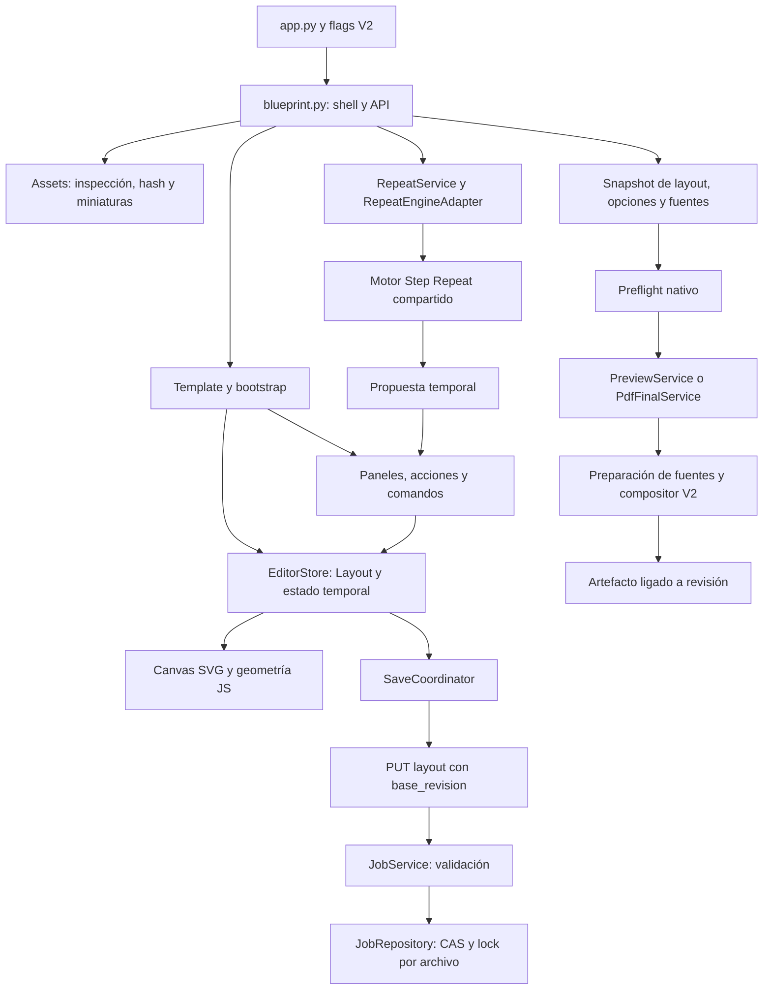

# Auditoría integral, mapa vigente y plan de mejoras de Editor Offset Visual V2

## 1. Estado, autorización y lectura

Fecha local de auditoría y consolidación: **2026-09-19, America/Asuncion**. Algunas evidencias llevan fecha UTC 2026-09-20. Código observado: `3bc0508` (cierre 39C), rama `codex/editor-offset-v2-stabilization`.

**Estado: auditoría ejecutada y alineación documental. Los defectos siguientes siguen abiertos; este documento no constituye su implementación ni aprueba cambios del motor compartido.**

El usuario autorizó revisar documentación/código V2, ejecutar pruebas, iniciar Flask mediante `editor-offset-local-qa` y usar navegador. Después autorizó crear este documento y alinear el mapa documental. No se modificó código productivo, no se hicieron commits, merge ni push. Se usaron jobs nuevos y directorios temporales; el job del usuario no fue editado.

Puntos de entrada:

- [20 — Estado operativo](20_ESTADO_ACTUAL_POST_REDISENO_UX_V2.md): resumen actual y acceso a la evidencia histórica.
- [README — Índice documental](README.md): clasificación de todos los documentos.
- Este documento: hallazgos, evidencia, mapa funcional, brechas y siguiente plan SAFE.
- [39 — Cierre de salida](39_PLAN_SAFE_CIERRE_SALIDA_PRODUCTIVA_V2.md): implementación y aceptación histórica 39A–39C.

Los contratos 01/02/21 y los schemas no se sustituyen por este informe. Una diferencia entre contrato y ejecución se registra como conflicto, no se resuelve cambiando silenciosamente la intención contractual.

## 2. Alcance real y límites

Inventario al inicio: 44 Markdown en V2, 36 Python en `editor_offset_v2`, 34 JavaScript incluyendo el entrypoint, un template HTML y un CSS. Se revisaron en detalle documentos 20–39 (incluyendo 32A–32F), contratos y antecedentes, rutas, servicios, geometría, persistencia, salida y conexiones frontend. La profundidad fue por flujo/riesgo; inventariar archivos no equivale a demostrar todas las combinaciones posibles.

Se ejecutaron las suites V2 y casos adicionales aislados. No se ejecutó la suite global ni recorridos UI V1. El motor `engines/step_repeat_pro_engine.py` se inspeccionó y ejercitó mediante su consumidor V2 porque Repeat importa esa dependencia compartida. No se modificó ese motor.

Clasificación de evidencia:

- **Ejecución:** resultado observado en navegador, endpoint o servicio real.
- **Artefacto:** layout/PDF inspeccionado, con comprobación geométrica o visual.
- **Código:** flujo identificado estáticamente, sin atribuirle una prueba que no se hizo.
- **Reporte del usuario:** caso pendiente de contrastar con su job concreto.
- **Propuesta:** mejora o decisión todavía no implementada.

No se acredita certificación PDF/X, color, RIP/CTP, seguridad exhaustiva, todos los PDFs externos ni todos los fallos de infraestructura.

## 3. Estado funcional vigente

| Superficie | Existe actualmente | Límite o siguiente trabajo |
|---|---|---|
| Jobs y assets | Jobs propios, PDF multipágina, originales inmutables, revisión optimista/CAS | Falta gestión visible de recientes, apertura y nombre |
| Edición manual | Selección, drag, rotación cardinal, clipboard, locks, X/Y, nudge, undo/redo | Resize del slot sigue pendiente |
| Composición | Alinear, distribuir, gap por eje, matriz y Repeat | Gap no conserva una cuadrícula; Repeat desperdicia huecos entre works |
| Precisión | Kernel JS/Python, reglas, guías, snap, medición y visibilidad temporal | Guías/preferencias no son persistentes |
| Corrección gráfica | Fit, escalas, offset, giro interno, espejo, clip y derivados | Derivado rotado con offset tiene defecto confirmado |
| Preflight | Reporte nativo ligado a revisión, opciones y fuentes | Bloqueos warning, alcance por cara, cantidades y área imprimible requieren corrección |
| Salida | Preview PNG y PDF nativo detrás de gates separados | Perfil limitado; no PDF/X, conversión de color, marcas avanzadas ni CTP |
| Marcas de corte | Contrato, comprobaciones y compositor | Falta control operativo para encender/apagar |
| Caras | Contrato/backend y salida para caras habilitadas | Edición y navegación de dorso no forman un flujo completo de UI |
| Operación | Snapshots, bloqueo por archivo, publicación atómica, retención explícita | No implica aceptación multi-host ni purga automática |

## 4. Mapa funcional y propietarios



| Responsabilidad | Fuente ejecutable principal | Contrato que debe conservar |
|---|---|---|
| API y gates | `editor_offset_v2/blueprint.py`, `config.py` | Errores estructurados; gates independientes |
| Layout | `domain/layout_v2.py`, `validation.py`, `schemas/layout-v2.schema.json` | V2 limpio; mm; centro trim; cardinales; referencias |
| Geometría | `domain/geometry.py`, `static/js/editor_offset_v2/geometry_kernel.js` | Paridad mediante fixtures; footprint derivado |
| Estado y guardado | `store.js`, `commands.js`, `autosave.js`, `job_service.py`, `job_repository.py` | Historial, dirty, CAS, escritura atómica |
| Assets | `asset_service.py`, `asset_repository.py`, `pdf_inspector.py`, `thumbnail_renderer.py` | Originales inmutables e identidad física |
| Repeat | `repeat_panel.js`, `repeat_service.py`, `repeat_engine_adapter.py`, motor compartido | Propuesta temporal; aplicar reversible; cantidades y locks |
| Corrección/derivados | `content_transform_inspector.js`, comandos, `derived_asset_service.py` | Contenido separado de geometría; original intacto |
| Preflight | `preflight_service.py`, `preflight_contract.py`, `native_output_capabilities.py` | Cobertura, referencias y decisión por operación |
| Salida | `output_snapshot.py`, `prepared_pdf_source.py`, `pdf_compositor.py`, servicios Preview/PDF | Mismas fuentes/opciones/revisión; entrega completa |
| Presentación | Template V2, CSS V2, `dom_refs.js`, `bootstrap.js` y controladores | Selectores, foco, atajos y responsive |
| Compatibilidad histórica | `output_service.py`, `editor_output_adapter.py`, `legacy_output_probe.py`, `prepared_output_adapter.py` | Ensayo/diagnóstico separado de la salida nativa |

La salida nativa ya tiene compositor propio. Repeat **todavía comparte motor** con V1. Los paneles de assets/Repeat/corrección también tienen rutas directas hacia comandos; no describir todo el frontend como si todas las acciones atravesaran ya `command_registry.js`.

Persistencia bajo la raíz configurada: `layout_v2.json`, `assets/`, `derived/`, `previews/`, `outputs/`, `reports/`. Selección, viewport, guías, borradores y propuestas no son campos persistentes del layout.

## 5. Registro priorizado de hallazgos

P1: afecta la confianza en salida; P2: corrección funcional/operación; P3: mantenimiento. Los IDs son de esta auditoría, no códigos de API nuevos.

| ID | Prioridad y estado | Hecho / impacto | Superficie |
|---|---|---|---|
| AUD-001 | P1, reproducido | Warning con `blocks=pdf_final` termina en `eligible`; PDF generado | `preflight_service.py`, `preflight_contract.py` |
| AUD-002 | P1, reproducido y medido | Materializar derivado de slot a 90° con offset altera posición | Inspector, comando de derivado, servicio de derivados |
| AUD-003 | P2, reproducido | Error geométrico del dorso bloquea petición solo frente | Alcance de preflight/snapshot |
| AUD-004 | P2, reproducido | Márgenes mayores al pliego se guardan; preflight/PDF responden 500 | Validación de pliego y `_geometry_findings` |
| AUD-005 | P2, brecha reproducida | 999 formas solicitadas y 1 slot no generan hallazgo de cantidad | Política y checks de cantidades |
| AUD-006 | P2, observado en UI | Marcas activas sin control para desactivarlas; error ofrece una acción inaccesible | Defaults, panel Salida y perfiles |
| AUD-007 | P2, necesidad de producto | Gap exacto trata selección como secuencia; no conserva filas/columnas | `alignment_operations.js`, panel de disposición |
| AUD-008 | P2, reproducido | Preview de pliego 700×500 a 300 dpi supera límite; opción se ofrece sin anticipación | Recursos, preflight y panel Salida |
| AUD-009 | P2, evidencia documental | Estado vigente mezclado con roadmaps y resultados antiguos | 20, 11, 01, 21, AGENTS y referencias |
| AUD-010 | P2, sensibilidad observada | Test de 500 placements excedió 60 s en ejecución concurrente; aislado pasó | Presupuesto/rendimiento y aceptación |
| AUD-011 | P3, código y arranque observado | Función PowerShell retorna mensajes y booleano por la misma salida; PID obsoleto puede evaluarse como verdadero | `start_flask.ps1: Test-SavedProcessIsActive` |
| AUD-012 | P3, código/UX | CSS con capas sucesivas; terminología técnica; paneles largos; corrección fuera de registro central | CSS, template, bootstrap/controladores |
| AUD-013 | P2, reproducido con PDF sintético | Cuatro páginas caben; Repeat coloca tres en columna y declara una faltante | Adaptador V2 y motor compartido por franjas |

### AUD-001 — Severidad y bloqueo son independientes

Dos slots de 90×50 mm, bleed de 3 mm y distancia entre centros X de 93 mm: trims separados por 3 mm y sangrados superpuestos. Resultado: `BLEED_OVERLAP`, severidad `warning`, `blocks=[pdf_final,ctp]`, decisión PDF `eligible`, endpoint PDF 200. También se reprodujo el mismo problema con `BLEED_OUTSIDE_PRINTABLE`.

El productor de decisiones y el validador filtran únicamente `severity == error`. Esto contradice 21: un warning puede bloquear. La corrección debe incluir ambos lados y tests que comprueben ausencia de artefacto cuando corresponda bloquear; no basta cambiar el color del mensaje.

### AUD-002 — Derivado y coordenadas del offset

Caso aislado: fuente vectorial 90×50 mm, slot a 90°, escala interna 0,5 y offset X=10 mm, sin marcas. Se generó PDF antes y después de materializar y restablecer la transformación interna.

Centroides de tinta a 150 dpi, expresados en mm del pliego:

| | X | Y |
|---|---:|---:|
| Antes | 101,56298 | 87,35338 |
| Después | 91,42425 | 97,030625 |
| Diferencia | −10,13873 | +9,67725 |

La inspección visual confirma el desplazamiento. El inspector envía `content_transform` pero no la rotación geométrica del slot. Hornear el offset en coordenadas de página y rotar después el derivado cambia el significado del desplazamiento en ejes del pliego. Hay que definir y probar la conversión entre marcos, sin alterar originales ni compensar silenciosamente layouts existentes.

Evidencia local temporal: `%TEMP%/v2-derived-audit-999wam4k/{before,after}.pdf`. Estos archivos no son fixtures versionados ni una ruta productiva.

### AUD-003 a AUD-005 — Alcance y validación

- Frente válido + slot del dorso con X fuera del pliego; petición `face=front`: PDF 422 por problema del dorso. El contrato 21 exige checks físicos/productivos sobre caras solicitadas, manteniendo la validación estructural del layout completo.
- Pliego ancho 700 mm + margen izquierdo 701 mm: PUT aceptado; preflight y PDF devuelven 500 porque `Bounds` falla antes del diagnóstico `PRINTABLE_AREA_EMPTY`. La UI de pliego ya rechaza esa entrada; falta coherencia en servidor.
- `requested_forms=999`, un slot: preflight sin hallazgos y PDF 200. No imponer una política nueva sin decidir parcialidad/sobrantes y su confirmación explícita. `last_result` es histórico, no una aceptación de la cantidad actual.

### AUD-006 y AUD-007 — Marcas y separaciones

Los jobs nacen con márgenes/gaps cero y crop marks activadas. En QA, Repeat produjo un montaje bloqueado por marcas fuera del pliego/invasión de trim. La UI recomienda desactivar marcas, sin control para hacerlo.

Ya existe seleccionar todos: `Ctrl/Cmd+A` fuera de inputs o **Ajustar → Todos · cara**. Respeta cara y visibilidad; no selecciona ocultos. El gap H/V existente ordena toda la selección por eje y aplica separación secuencial: al usarlo sobre varias filas, cambia la cuadrícula. Es una limitación de la semántica actual, no prueba de que la selección múltiple esté ausente.

Propuesta: control de marcas con alcance explícito; herramienta separada de separación H/V que conserve filas/columnas. Definir piezas de tamaños mixtos, ancla, referencia trim/bleed, locks, orden y vista previa antes de implementar. Una matriz duplica; no debe usarse como sustituto de redistribuir piezas existentes.

### AUD-013 — Repeat multipágina deja huecos aprovechables

**Reporte del usuario confirmado por layout y reproducción:** selecciona cuatro páginas, se colocan tres una encima de otra y queda espacio lateral para la cuarta. Se leyó su job por API y se reprodujo Repeat sobre una copia en memoria, sin aplicar ni guardar cambios.

Caso real: `ev2_c2ae50a13c42689bafd97ab3`, revisión 26 antes y después de la inspección. PDF de 29 páginas; works para páginas 1–4, MediaBox, cada uno de 254×142,875 mm, una forma, bleed cero, giros 0/90/180/270. Pliego 700×500 mm, márgenes cero y gaps H/V de 3 mm. El resultado persistido y la reproducción del adaptador coinciden: solicitadas 4, colocadas 3, faltante 1. Centros actuales: (127;71,4375), (127;217,3125), (127;363,1875) mm.

Una alternativa 2×2 con centros (127;71,4375), (384;71,4375), (127;217,3125), (384;217,3125) ocupa **511×288,75 mm** y fue verificada con el kernel: dentro del pliego y sin solapes. Esto demuestra capacidad geométrica para las cuatro páginas. No acredita marcas de corte con margen cero/gap de 3 mm; esas restricciones deben comprobarse separadamente antes de exportar. El montaje del usuario permanece intacto.

**Reproducción independiente ejecutada:** PDF físico sintético con cuatro páginas de 210×148 mm; un work por página, una forma por work; pliego 700×500 mm; márgenes 10 mm; gaps H/V de 8 mm; bleed cero; rotaciones 0/90/180/270; zona/flujo auto; fill desactivado. Peticiones mediante Flask test client y almacenamiento temporal.

| Dev tools | Parcialidad | Resultado |
|---|---|---|
| Apagadas | No | `success=false`, `INCOMPLETE_IMPOSITION`, sin propuesta aplicable |
| Apagadas | Sí | Solicitadas 4, colocadas 3, faltante 1 |
| Encendidas | No | Mismo resultado que apagadas |
| Encendidas | Sí | Mismas posiciones: (115,84), (115,240), (115,396) mm |

Una alternativa 2×2, centros **(115,84), (333,84), (115,240), (333,240)** mm, fue comprobada con el kernel: todas las piezas dentro del imprimible y sin solapes, con gaps de 8 mm. Huella de grupo 428×304 mm dentro de área imprimible 680×480 mm. Se prueba factibilidad geométrica; no se generó una certificación de salida para esta alternativa.

Causa confirmada: `RepeatEngineAdapter._engine_layout` pasa cada work como diseño independiente. `append_step_repeat_slots_in_bounds` del motor compartido recorre diseños, coloca cada uno desde el borde izquierdo y avanza `cursor_y` al terminarlo. No reutiliza el resto lateral de la fila para el work siguiente. En el camino auto sin zonas ni fill, esa disposición por franjas decide que faltan formas. El mensaje «no caben» confunde un fracaso de esta heurística con imposibilidad geométrica.

La reproducción y las posiciones persistidas del job real muestran piezas apiladas verticalmente **sin solaparse**. «Una encima de otra» describe aquí la columna, no una superposición de trims.

Evidencia local temporal: `%TEMP%/v2-repeat-four-pages-uprnly05/evidence.json`. No se aplicó la propuesta al job del usuario ni se cambiaron flags del Flask live.

Corrección propuesta: permitir que works distintos aprovechen filas/huecos respetando identidad, cantidades, bleed/gaps y orientaciones. No habilitar nesting/hybrid incidentalmente. Si se modifica el motor compartido, declarar el impacto sobre V1 y acordar su validación; la alternativa V2 propia también exige diseño y fase separados. Distinguir «no se encontró una disposición» de «la pieza excede las dimensiones permitidas».

## 6. Evidencia de pruebas y navegador

| Comprobación ejecutada | Resultado observado |
|---|---|
| Python `tests/editor_offset_v2` | 544 passed, 1 failed, 1 skipped; 140,82 s |
| Fallo Python | `test_bounded_placement_load_with_shared_vector_source[500]`: 61,343 s frente a umbral 60; aserciones de contenido superadas |
| Repetición aislada de ese caso | 1 passed; 52,31 s totales de pytest; no confundir con tiempo exclusivo de render |
| Node V2 | 124 passed |
| Dos Playwright de edición/UX | 22 passed |
| `test_editor_offset_v2_output_integration.py` | 5 passed; total browser V2 27 |
| Sintaxis JS | 34 archivos correctos |
| Python AST | 36 módulos parseados correctamente |
| HTML | Sin IDs estáticos duplicados |
| Git al terminar la auditoría de código | `diff --check` correcto y worktree limpio antes de esta alineación documental |
| Nuevos casos aislados | AUD-001/002/003/004/005/013 reproducidos; no son aún regresiones versionadas |

El test omitido de symlink depende de privilegios Windows; no se acredita su validación. La primera suite Python coincidió con otras pruebas; la repetición aislada no demuestra la causa del exceso de tiempo. No existe comparación equivalente contra otra base para llamar preexistente a un fallo.

QA live: job `ev2_30f71c4735d984e950d6644b`, revisión 8. Fixture `multipage-rotations.pdf`, tres páginas y dos formas por página. Carga, planificación, Repeat, selección, gap, undo, márgenes, guardado, recarga, preflight y Preview/PDF recorridos. Paneles observados también a 820×900; viewport restaurado. Consola sin errores/warnings en el recorrido consultado.

PDF inspeccionado: `outputs/pdf_final_r8_front_150_6cebdb7c5d54f2c6.pdf`, una página 700×500 mm, 13.126 bytes, seis identificadores de contenido, 60 drawings y cero imágenes incrustadas para este fixture vectorial. SHA-256 `88d287461a509f78ff19e3555e0bc198148b6c7b95f74044d66898a40c08b991`. La UI confirmó inicio de descarga; se inspeccionó el archivo del servidor. La descarga real está cubierta por el Playwright de integración; no se atribuye una inspección manual del archivo descargado que no se hizo.

## 7. Mapa documental y conflictos

El [índice README](README.md) clasifica cada archivo. Regla: un cierre histórico conserva sus resultados; no se reescribe para fingir que las pruebas posteriores ya existían.

- **20:** entrada operativa actual arriba; su cuerpo previo se conserva como archivo histórico colapsado. El nuevo mapa de riesgos está en 40.
- **01/02:** contrato persistente y geometría; los comentarios de alcance de fases antiguas no describen toda la aplicación actual. La extensión opcional `source.derived` existe en schema/validador y fases 32D–32F; no convertir propuestas como `derived_from` en campos reales.
- **03:** contrato del puente temporal vigente para esa frontera; no gobierna el compositor nativo.
- **04–19:** historia y contratos de herramientas concretas; los «próximos pasos» son del corte de cada fase.
- **11:** decisiones vigentes se distinguen de propuestas previas; bloqueo por archivo, reporte y compositor ya existen. Quedan pendientes independencia de Repeat, alcance industrial y políticas.
- **21/24/35/39A:** contrato y evolución del preflight. AUD-001/003/005 son brechas frente a ese contrato, no autorización para omitirlo.
- **22/23/26–33:** ensayos, fixtures y evolución raster/transformaciones/derivados. «Raster» puede describir una fase anterior o un derivado, sin describir todo PDF nativo actual.
- **34:** soporte multipágina/orientaciones no equivale a aprovechamiento global del espacio entre works; añadir referencia a AUD-013.
- **36/38:** endurecimiento/lifecycle implementados, sin aceptación multi-host ni retención automática.
- **37/39B:** paridad y compositor propio; falta regresión del derivado rotado con offset.
- **39C:** cierre histórico real; esta auditoría añade límites y defectos. Sus conteos previos no se reemplazan con los de la auditoría.
- **AGENTS:** guía de lectura y siguiente gate alineados; incluir los tres Playwright V2. Sin datos efímeros de job, branch o conteos de tests.

Deuda adicional: comentarios `PdfFinalService` («raster compositor») y `prepared_pdf_source` («temporary renderer/trial») no describen sus usos actuales. Se registran para una futura corrección de comentarios; esta fase documental no edita Python.

## 8. Mejoras de producto propuestas

1. **Marcas:** estado visible on/off; alcance global/selección explícito; comando reversible; coherencia Preview/PDF; no modificar perfiles compartidos accidentalmente.
2. **Separación en cuadrícula:** H/V simultáneo, conservar filas/columnas, definir ancla/tamaños mixtos/trim o bleed, previsualización y undo único.
3. **Repeat:** reutilizar huecos entre trabajos, diagnóstico honesto de heurística, contar faltantes por página y mostrar alternativa antes de aplicar.
4. **Validar:** preflight nativo primero y abierto; diagnóstico legacy secundario/colapsado. Distinguir gate CTP apagado de error del montaje.
5. **Errores accionables:** nombre de trabajo, archivo/página, selección de piezas y zoom; evitar exigir que el operador interprete IDs largos.
6. **Preview:** vista amplia con zoom; revisión/opciones visibles; separar resolución de Preview de preservación de objetos PDF; anticipar presupuesto de píxeles.
7. **Preparación:** reducir duplicación entre planificador multipágina y creación manual; aclarar cantidades planificadas frente a works ya creados; entrar en Preparar al crear un job vacío.
8. **Gestión de jobs:** recientes, abrir, renombrar y duplicar mediante flujos explícitos; definir integridad de assets al duplicar antes de implementarlo.
9. **Lenguaje:** Trabajo/Pieza/Archivo/Sangrado/Separación en UI, conservando nombres contractuales internos.
10. **Mantenimiento:** CSS por componente/breakpoint; integrar corrección gráfica en acciones y coordinación de borradores; revisar identidad derivada en indicadores de fuente.

## 9. Plan SAFE propuesto, aceptación y rollback

La redacción de este plan no autoriza automáticamente su código. Implementar cada bloque por separado y actualizar evidencia al cerrarlo.

| Bloque | Trabajo y superficies | Aceptación mínima | Contención / rollback |
|---|---|---|---|
| D — Mapa documental | 40, README, entradas 20/01/03/11/21/34/39 y AGENTS | Clasificación inequívoca, enlaces válidos, historia conservada | Revertir solo el diff documental |
| S1 — Bloqueos y validación | Preflight productor/validador, área imprimible, alcance por cara | Warning bloqueante impide PDF y publicación; márgenes inválidos generan 4xx/hallazgo; frente no depende del dorso excluido | Mantener gates; revertir cambios focalizados; sin reescribir jobs |
| S2 — Derivados | Inspector/comando/servicio y conversión de coordenadas | Giros 0/90/180/270 + offsets ±X/±Y mantienen posición; comparar ROI, no solo fondo blanco; undo y originales intactos | Contener materialización afectada si no puede garantizarse; preservar derivados existentes |
| R — Repeat multipágina | Adaptador V2 y estrategia de colocación definida | Caso cuatro páginas coloca 4; variantes bleed/gaps/mixed sizes/rotaciones/locks/add/replace/partial/fill; resultado determinista y sin overlaps | No tocar motor compartido sin análisis V1; revertir estrategia/adaptador; propuestas no aplicadas no alteran layout |
| U1 — Marcas | Perfil existente, comandos, panel y renderer | Toggle persiste, undo/redo/recarga; marcas coherentes en PDF/Preview; bloqueos se recalculan | Sin cambio de schema necesario para el booleano existente; revertir UI/comando sin invalidar layout |
| U2 — Separaciones | Plan geométrico puro, acción, comando, panel | Mantiene cuadrícula y cantidades; anclas/locks; una operación; aviso fuera imprimible | Acción nueva distinguible del gap secuencial actual |
| U3 — Claridad | Preflight visible, Preview amplia, nombres, recursos y preparación | Recorrido de operador con errores corregibles y sin cambios incidentales de datos | Cambios UI focalizados y regresión responsive |

Antes de S1 acordar la política de cantidades de AUD-005; no mezclar su decisión con la corrección inequívoca de `blocks`. Antes de R confirmar si se mantiene el agrupamiento por work como opción y cómo se llenan huecos. El defecto está demostrado tanto en la prueba sintética como en la copia en memoria del job específico del usuario.

No adelantar CTP, PDF/X, conversión de color, nesting/hybrid, resize, navegación completa de dorso, IA, migración de framework ni cambio del schema dentro de estas correcciones.

Comandos de regresión V2 al modificar comportamiento (no hace falta repetirlos por editar solo Markdown):

```powershell
venv\Scripts\python.exe -m pytest tests\editor_offset_v2 -q
$editorV2JsTests = Get-ChildItem -LiteralPath tests\editor_offset_v2\js -Filter *.test.cjs | ForEach-Object { $_.FullName }
node --test $editorV2JsTests
venv\Scripts\python.exe -m pytest tests\playwright\test_editor_offset_v2.py tests\playwright\test_editor_offset_v2_ux_characterization.py tests\playwright\test_editor_offset_v2_output_integration.py -q
git diff --check
```

## 10. Herramientas de desarrollo y arranque

`EDITOR_OFFSET_V2_DEV_TOOLS_ENABLED` controla UI de prueba (p. ej. **Placeholder dev**). No activa un mejor motor, no amplía capacidad de Repeat, no habilita nesting y no desbloquea PDF/Preview. Un placeholder no representa un PDF físico exportable y Repeat exige assets reales `ready`.

El problema AUD-013 se reprodujo con el flag en ambos valores. Activarlo no es una corrección. Para QA productiva mantenerlo en cero.

Arranque habitual con salida:

```powershell
powershell -NoProfile -ExecutionPolicy Bypass -File scripts/start_editor_offset_v2_output_qa.ps1 -Restart
```

Activación opcional de herramientas dev, si el operador decide usar controles ficticios: detener primero **solo el proceso registrado** y arrancar con el switch soportado:

```powershell
powershell -NoProfile -ExecutionPolicy Bypass -File .agents/skills/editor-offset-local-qa/scripts/stop_flask.ps1
# Continuar únicamente si el stop termina correctamente.
powershell -NoProfile -ExecutionPolicy Bypass -File .agents/skills/editor-offset-local-qa/scripts/start_flask.ps1 -Target v2 -EnableV2DevTools
venv\Scripts\python.exe .agents/skills/editor-offset-local-qa/scripts/check_flask.py --target v2
```

Este segundo arranque no habilita por sí solo gates de Preview/PDF/derivados. El wrapper de salida solo acepta `-Restart`, no `-EnableV2DevTools`. Para una sesión combinada, los tres flags de salida deben pasarse al proceso hijo preservando/restaurando el entorno, como hace el wrapper; no usar cambios de variables de usuario/máquina. No se reinició ni activó dev tools en el Flask live durante esta consolidación.

## 11. Pendientes de evidencia

- Caso de cuatro páginas del usuario: configuración y resultado ya comprobados en revisión 26; falta implementar/cubrir la corrección y validar su salida con marcas, sin alterar el montaje original durante la auditoría.
- Convertir reproducciones aisladas en fixtures/regresiones versionadas al autorizar correcciones.
- Medir el caso de 500 placements bajo condiciones controladas; no aumentar el umbral para ocultar un problema.
- Validar políticas de cantidades y sangrado compartido con decisiones explícitas.
- Completar QA industrial (color, fuentes, transparencias/sobreimpresión y RIP) en su fase; el perfil nativo limitado no acredita todas esas capacidades.

## 12. Cierre de esta alineación documental

Se crearon 40 y README; se alinearon las entradas de 01, 03, 11, 20, 21, 34, 39 y AGENTS. El índice clasifica los 45 documentos numerados, incluyendo este informe. Los cuerpos históricos de 20 y 11 se conservan íntegros en secciones desplegables. No se reescribieron resultados históricos como si fueran pruebas actuales.

Validación: diez archivos Markdown nuevos/modificados revisados, enlaces locales comprobados, bloques de código y desplegables balanceados, `git diff --check` correcto. La suite completa no se repitió por estas ediciones exclusivamente documentales; se conservaron sus resultados de la auditoría y se ejecutaron las reproducciones nuevas de Repeat descritas arriba. Sin cambios de Python/JS/CSS/HTML/schema, sin commit ni push. Ningún hallazgo quedó marcado como corregido por redactar este documento.
