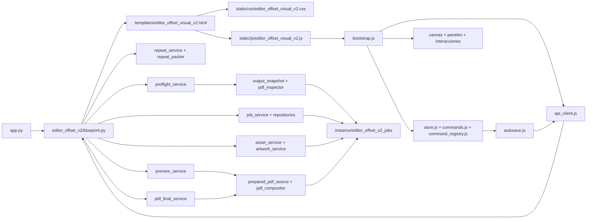

# Mapa de conexiones del Editor Offset Visual V2

Levantamiento estático inicial y contraste posterior con ejecución, 2026-09-27. Este mapa identifica archivos y relaciones comprobadas en el código; los documentos históricos aportan contexto y no prueban por sí solos el comportamiento. La primera intervención no ejecutó el sistema. La verificación posterior autorizada, sus correcciones y límites se registran al final de este documento y en 41; la aceptación previa de salida está en 43.

## Vista de conjunto



`app.py` registra el blueprint V2. Su arranque también importa y registra `routes.py` legacy: el flujo de producto V2 reside en módulos propios, pero no se puede afirmar independencia de **todo el proceso Flask**. La importación de `editor_offset_v2/__init__.py` carga además el adaptador de diagnóstico histórico. Esta distinción importa al auditar dependencias transitivas.

## Entradas HTTP y consumidores

Todas las rutas viven en `editor_offset_v2/blueprint.py`, bajo `EDITOR_OFFSET_V2_ENABLED`. El HTML inserta un contexto JSON con URLs, layout, revisión y capacidades; la entrada JS lo entrega a `bootstrap.js`.

| Método y ruta | Servicio o resultado | Consumidor principal |
|---|---|---|
| GET `/editor_offset_visual_v2` | shell sin job | navegación de preparación |
| GET `/editor_offset_visual_v2/<job_id>` | shell con layout/contexto | `bootstrap.js` |
| POST `/api/editor-offset-v2/jobs` | `JobService`, revisión inicial | `api_client.js` / preparación |
| GET `/api/editor-offset-v2/jobs/<job_id>` | `JobService` | API disponible; el arranque del editor usa el contexto HTML |
| PUT `/api/editor-offset-v2/jobs/<job_id>/layout` | `JobService`, compare-and-swap con `base_revision` | `autosave.js` |
| POST `/api/editor-offset-v2/jobs/<job_id>/assets` | `AssetService` | `assets_panel.js` |
| GET `/api/editor-offset-v2/jobs/<job_id>/assets/<asset_id>/thumbnails/<page>` | miniatura PDF | panel de assets |
| GET `/api/editor-offset-v2/jobs/<job_id>/assets/<asset_id>/artwork/<page>` | función `render_artwork` de `artwork_service.py` | canvas |
| POST `/api/editor-offset-v2/jobs/<job_id>/imposition/repeat` | `RepeatService`, propuesta temporal | `repeat_panel.js` |
| GET `/api/editor-offset-v2/jobs/<job_id>/output-capabilities` | diagnóstico del puente histórico | sin llamada desde la UI habitual |
| POST `/api/editor-offset-v2/jobs/<job_id>/preflight` | `PreflightService`; recibe `face`, `dpi`, `allow_mirror_bleed` y devuelve decisiones por operación | `output_panel.js` |
| POST `/api/editor-offset-v2/jobs/<job_id>/preview` | `PreviewService`; gate Preview | `output_panel.js` |
| POST `/api/editor-offset-v2/jobs/<job_id>/pdf-final` | `PdfFinalService`; gate PDF | `output_panel.js` |
| POST `/api/editor-offset-v2/jobs/<job_id>/assets/<asset_id>/derived-page` | `DerivedAssetService`; gate derivados | inspector de contenido |

Los gates Preview, PDF y derivados son separados en `config.py` y `blueprint.py`; dev tools tiene otro flag. `scripts/start_editor_offset_v2.ps1` configura el arranque local habitual con Preview/PDF activos, derivados y dev tools apagados. Los scripts de QA usan configuración propia: no inferir la de otro despliegue a partir de ellos.

## Backend: inventario completo de propiedad V2

Son 40 archivos Python y 2 schemas JSON en `editor_offset_v2/`. La flecha de cada fila nombra la conexión funcional principal, no pretende listar cada import estándar o externo.

| Archivo | Papel y conexiones |
|---|---|
| `__init__.py` | paquete y exportaciones; importa el adaptador histórico al cargar el paquete |
| `config.py` | flags, raíz de jobs y límite de subida → `app.py`/blueprint |
| `blueprint.py` | 14 endpoints y contexto HTML → servicios de aplicación |
| `domain/__init__.py` | exportaciones del dominio |
| `domain/layout_v2.py` | constantes y vocabulario de Layout V2 → validación, servicios |
| `domain/validation.py` | valida el layout → servicios de jobs/preflight/salida; `JobRepository` no invoca el validador |
| `domain/geometry.py` | geometría en mm, rotaciones y colisiones → Repeat, preflight, salida |
| `domain/work_bleed.py` | decisión por trabajo y cobertura física → preparación, preflight y fuentes de salida |
| `domain/crop_marks.py` | posición/reglas de marcas → compositor y pruebas |
| `domain/repeat_contract.py` | contrato de propuesta Repeat → servicio/adaptador |
| `domain/repeat_packer.py` | empaquetado Repeat propio → `repeat_engine_adapter.py` |
| `domain/output_contract.py` | DTO de la frontera de diagnóstico histórico → `output_service.py` |
| `domain/output_parity_contract.py` | tolerancias/criterios de paridad → pruebas de salida |
| `domain/preflight_contract.py` | versión, operaciones y estructura del reporte → preflight/consumidores |
| `domain/preview_policy.py` | presupuesto de píxeles Preview → capacidades/preflight/Preview |
| `application/__init__.py` | paquete de servicios |
| `application/job_service.py` | crea/carga/guarda con revisión optimista → `job_repository.py` |
| `application/asset_service.py` | sube fuente y genera miniaturas → repositorio, inspector y renderer |
| `application/artwork_service.py` | imagen de arte para canvas → PDF preparado/compositor |
| `application/repeat_service.py` | valida petición y genera propuesta → adaptador Repeat |
| `application/native_output_capabilities.py` | capacidades nativas por operación → preflight/Salida |
| `application/preflight_service.py` | verifica layout, geometría, fuentes, cajas y decisiones → reporte/snapshot |
| `application/preview_service.py` | composición PDF y raster PNG de vista previa → fuente preparada/compositor |
| `application/pdf_final_service.py` | PDF de salida → fuente preparada/compositor |
| `application/derived_asset_service.py` | PDF derivado y manifiesto sin alterar fuente → repositorios |
| `application/output_service.py` | diagnóstico del puente antiguo → `editor_output_adapter.py`; fuera de Preview/PDF habitual |
| `infrastructure/__init__.py` | paquete de infraestructura |
| `infrastructure/job_repository.py` | layout y carpetas; escritura atómica, revisión CAS → disco |
| `infrastructure/asset_repository.py` | staging y fuentes inmutables → disco |
| `infrastructure/process_lock.py` | bloqueo entre procesos → repositorios/salida |
| `infrastructure/output_snapshot.py` | congela entradas, revisión, cupo y publicación de salida → preflight/Preview/PDF |
| `infrastructure/pdf_inspector.py` | páginas y cajas PDF físicas declaradas → assets/preflight/fuente preparada |
| `infrastructure/thumbnail_renderer.py` | miniaturas PDF → assets |
| `infrastructure/prepared_pdf_source.py` | fuente física, sangrado y espejo autorizado → Preview/PDF/derivados |
| `infrastructure/pdf_compositor.py` | coloca/clipea páginas, marcas y caras → Preview/PDF/artwork |
| `infrastructure/repeat_engine_adapter.py` | adapta Repeat al empaquetador V2 → `domain/repeat_packer.py` |
| `infrastructure/artifact_lifecycle.py` | retención/recuperación; sin invocador productivo localizado, sí pruebas |
| `infrastructure/editor_output_adapter.py` | adaptador de diagnóstico histórico → `output_service.py` |
| `infrastructure/prepared_output_adapter.py` | ensayo offline del puente → import local de `montaje_offset_inteligente` |
| `infrastructure/legacy_output_probe.py` | sonda offline legacy → imports locales de `montaje_offset_inteligente`/`montaje_offset` |
| `schemas/layout-v2.schema.json` | contrato JSON de layout, leído en pruebas; la validación runtime está en `domain/validation.py` |
| `schemas/preflight-report.schema.json` | contrato JSON del reporte de preflight |

No se encontró un import a `engines/`, `services/` legacy ni `strategies/` en el camino habitual de Repeat o salida nativa. Los imports legacy identificados pertenecen a las sondas/ensayos indicados. `artifact_lifecycle.py` tiene cobertura propia, pero su presencia no equivale a ejecución en producción.

## Frontend: inventario completo

`templates/editor_offset_visual_v2.html` define shell y paneles, inserta el contexto JSON y carga los 35 archivos `static/js/editor_offset_v2/*.js` en orden `defer`, seguidos de `static/js/editor_offset_visual_v2.js`. `static/css/editor_offset_visual_v2.css` define layout, estados, canvas y responsive. Los módulos se conectan mediante el espacio `EditorOffsetV2` en navegador; la entrada inicia `Bootstrap.start()`. `dom_refs.js` centraliza los IDs estáticos del HTML.

| Grupo | Archivos JS y relación principal |
|---|---|
| Inicio/estado | `bootstrap.js` compone el editor; `dom_refs.js` localiza DOM; `store.js` conserva layout/revisión, selección, historial y estado temporal; `commands.js` muta reversiblemente; `command_registry.js` despacha acciones; `shortcut_manager.js` conecta teclado; `autosave.js` guarda; `api_client.js` llama las rutas V2 |
| Semántica/geometría | `geometry_kernel.js` y `geometry_view.js` calculan/convierten coordenadas; `edit_policy.js` aplica permisos/locks; `source_semantics.js` interpreta fuente; `work_bleed.js` aplica decisión de sangrado; `layout_metrics.js` deriva medidas |
| Canvas | `canvas_renderer.js` pinta pliego, slots y arte; `interactions.js` controla puntero, selección, zoom y pan; `snap_engine.js` ajusta movimientos |
| Preparación/contenido | `preparation.js` mantiene borradores de preparación; `assets_panel.js` presenta PDF/páginas/trabajos y registra acciones; `content_transform_inspector.js` edita corrección interna y derivados |
| Repeat/salida | `repeat_panel.js` pide propuesta y aplica un comando reversible; `output_panel.js` unifica Validar/Salida, preflight, Preview y PDF |
| Objetos/selección | `object_operations.js`, `objects_panel.js`, `advanced_selection.js`, `object_tree.js`, `position_inspector.js`, `nudge_controller.js` conectan operaciones, árbol, posiciones y desplazamiento |
| Alineación/precisión | `alignment_operations.js`, `arrangement_panel.js`, `precision_tools.js`, `precision_panel.js` calculan y presentan alineación, distribución, matriz, reglas, guías y medición |
| Pliego/navegación | `sheet_panel.js` configura pliego; `workflow_navigation.js` controla etapas; `responsive_panels.js` adapta paneles |

Los 35 archivos se cargan desde la plantilla y se enlazan desde el bootstrap o sus pares. No se halló import frontend V1. `api_client.js` conserva `getJob`, aunque el arranque con job recibe el layout en el contexto HTML; la ruta GET sigue disponible. Los controles de derivados y dev tools dependen de sus flags.

### Recorridos de datos

1. **Preparación:** PDF subido → `AssetService`/`pdf_inspector` → asset inmutable + miniaturas → borrador en `preparation.js` → comandos para works/slots → `EditorStore` → `SaveCoordinator` → PUT con `base_revision` → `JobRepository`.
2. **Repeat:** layout y opciones → guardado pendiente → POST Repeat → `RepeatService`/packer V2 → propuesta temporal en store → `ApplyRepeatCommand` reversible → guardado. No se publica un layout al solo proponer.
3. **Salida:** Validar/Salida → guardado → POST preflight con opciones → reporte con decisiones para Preview/PDF/CTP. La UI examina la decisión de la operación elegida y solicita el artefacto con `expected_revision`. Cada generación backend congela un snapshot nuevo, ejecuta y consume su propio preflight; no reutiliza el reporte previo de la UI como autorización. Luego prepara la fuente PDF/derivado y compone PNG Preview o PDF final. El canvas obtiene arte mediante endpoint propio; la paridad debe contrastarse con archivos y no presumirse por compartir nombres de módulos.
4. **Historial:** comandos → undo/redo del store → dirty state → autosave; la revisión del servidor se comprueba en el PUT. Selección, viewport, borradores, propuesta Repeat y opciones de salida son temporales.

## Persistencia, configuración y límites físicos

La raíz predeterminada es `instance/editor_offset_v2_jobs/<job_id>/` con `layout_v2.json`, `assets/`, `derived/`, `previews/`, `outputs/` y `reports/`; `config.py` permite cambiarla. El layout usa `layout_schema_version=2`, milímetros, slots con centro trim, rotaciones cardinales, fuentes referenciadas y `job.revision`. El schema JSON y `validation.py` deben revisarse juntos al cambiar contrato. El PDF inspector toma las cajas realmente declaradas; una MediaBox sola no crea TrimBox/BleedBox implícitas. `works[].bleed_strategy` admite `source_only`, `mirror_if_missing` o ausencia histórica, con semántica distinta. La cobertura por cajas no certifica tinta útil en el borde.

## Referencias fuera del producto V2

### Dependencias técnicas

`requirements.txt` declara dependencias del proceso completo, no un entorno V2 aislado. Flask/Werkzeug conectan HTTP, plantillas y validación de peticiones; PyMuPDF (`fitz`) inspecciona, compone y rasteriza PDF; Pillow trabaja con PNG y bandas de sangrado. ReportLab genera fixtures y participa en el ensayo `prepared_output_adapter.py`; PyPDF2 aparece en la sonda legacy, no en el compositor nativo habitual. Estas bibliotecas generales son distintas del código de producto V1 compartido. La importación de `app.py` puede cargar otras dependencias por `routes.py`; este mapa no enumera cada dependencia transitiva del proceso.

| Zona | Archivos relacionados y uso |
|---|---|
| Arranque | `app.py`; `scripts/start_editor_offset_v2.ps1`, `scripts/check_editor_offset_v2_start.py`; `scripts/start_editor_offset_v2_output_qa.ps1`, `scripts/check_editor_offset_v2_output_qa.py` |
| Operación local | `.agents/skills/editor-offset-local-qa/SKILL.md` y `scripts/check_flask.py`, `start_flask.ps1`, `stop_flask.ps1` dentro de esa skill |
| Repositorio | `.gitignore` ignora la raíz de jobs; `AGENTS.md` fija reglas; archivo raíz `tatus` contiene solo avisos Git históricos con nombres V2 y no participa del editor |
| Fixture PDF | `tests/fixtures/editor_offset_v2/` contiene `boxes-missing.pdf`, `boxes-offset.pdf`, `front-back-flip.pdf`, `marks-clipping.pdf`, `mirror-bleed-candidate.pdf`, `multipage-rotations.pdf` y `generate_pdf_fixtures.py` |
| Fixture JSON | en la misma carpeta: `layout_v2_minimal.json`, `layout_v2_complete.json`, `geometry_cases.json`, `repeat_cases.json`, `output_adapter_cases.json`, `crop_mark_dimensions.json`, `work_bleed_coverage.json`, `pdf_fixture_manifest.json` |

### Pruebas localizadas

- **Python (`tests/editor_offset_v2/`, 28 módulos + `conftest.py`):** `test_artifact_lifecycle_v2.py`, `test_asset_service_v2.py`, `test_assets_routes_v2.py`, `test_derived_parity_v2.py`, `test_frontend_placeholder_v2.py`, `test_geometry_v2.py`, `test_job_repository_v2.py`, `test_job_service_v2.py`, `test_layout_v2_contract.py`, `test_legacy_output_probe_v2.py`, `test_native_compositor_v2.py`, `test_output_acceptance_v2.py`, `test_output_adapter_v2.py`, `test_output_parity_contract_v2.py`, `test_output_safety_v2.py`, `test_pdf_final_v2.py`, `test_pdf_fixture_parity_v2.py`, `test_pdf_inspector_v2.py`, `test_preflight_decisions_v2.py`, `test_preflight_v2.py`, `test_prepared_output_probe_v2.py`, `test_prepared_pdf_source_v2.py`, `test_preview_v2.py`, `test_repeat_engine_adapter_v2.py`, `test_repeat_packer_v2.py`, `test_repeat_service_v2.py`, `test_routes_v2.py`, `test_work_bleed_v2.py`.
- **Node (`tests/editor_offset_v2/js/`, 18 módulos):** `advanced_selection_object_tree_v2.test.cjs`, `alignment_distribution_matrix_v2.test.cjs`, `assets_commands_v2.test.cjs`, `crop_marks_v2.test.cjs`, `editor_core_v2.test.cjs`, `geometry_parity_v2.test.cjs`, `object_operations_v2.test.cjs`, `output_diagnosis_v2.test.cjs`, `positioning_commands_v2.test.cjs`, `preparation_v2.test.cjs`, `repeat_commands_v2.test.cjs`, `repeat_proposal_freshness_v2.test.cjs`, `responsive_panels_v2.test.cjs`, `rulers_guides_snap_measurement_v2.test.cjs`, `semantic_stabilization_v2.test.cjs`, `sheet_configuration_v2.test.cjs`, `work_bleed_v2.test.cjs`, `workflow_navigation_v2.test.cjs`.
- **Navegador (`tests/playwright/`, 6 V2):** `test_editor_offset_v2.py`, `test_editor_offset_v2_ux_characterization.py`, `test_editor_offset_v2_output_integration.py`, `test_editor_offset_v2_native_repeat.py`, `test_editor_offset_v2_preparation.py`, `test_editor_offset_v2_work_bleed.py`. Otros tests Playwright de `test_editor_*` corresponden a V1 y no se incluyen en el mapa V2.

### Documentación localizada

Los 49 Markdown de `DOCS/OFFSET/V2/` anteriores a este mapa comprenden `README.md` y los siguientes documentos. Los nombres se listan para que una búsqueda de responsabilidad encuentre el antecedente correspondiente; su estado debe contrastarse con el código.

- **Base, shell y herramientas (01–17):** `01_CONTRATO_LAYOUT_V2.md`, `02_KERNEL_GEOMETRICO_V2.md`, `03_ADAPTADOR_SALIDA_V2.md`, `04_SHELL_Y_JOBS_V2.md`, `05_CANVAS_STORE_V2.md`, `06_ASSETS_Y_SLOTS_V2.md`, `07_REPEAT_V2.md`, `08_AUDITORIA_ESTADO_ACTUAL_V2.md`, `09_PLAN_HERRAMIENTAS_MANUALES_V2.md`, `10_ESTABILIZACION_SEMANTICA_V2.md`, `11_DECISIONES_ARQUITECTONICAS_PENDIENTES_V2.md`, `12_CORRECCION_COMPATIBILIDAD_DE_MEDIDA_Y_ETIQUETAS_V2.md`, `13_POSICIONAMIENTO_Y_COMANDOS_V2.md`, `14_OPERACIONES_DE_OBJETO_Y_CLIPBOARD_V2.md`, `15_ALINEACION_DISTRIBUCION_Y_MATRIZ_V2.md`, `16_SELECCION_AVANZADA_Y_ARBOL_V2.md`, `17_REGLAS_GUIAS_SNAP_Y_MEDICION_V2.md`.
- **Estado, UX y salida inicial (18–31):** `18_ESTADO_ACTUAL_POST_EXPLORACIONES_1_A_4_V2.md`, `19_PLAN_Y_TRAZABILIDAD_REDISENO_UX_V2.md`, `20_ESTADO_ACTUAL_POST_REDISENO_UX_V2.md`, `21_CONTRATO_PREFLIGHT_V2.md`, `22_ENSAYO_REUTILIZACION_SALIDA_V1.md`, `23_PREPARACION_FUENTES_Y_PARIDAD_SALIDA_V2.md`, `24_PREFLIGHT_EJECUTABLE_V2.md`, `25_AUDITORIA_COMPLETA_QA_V2.md`, `26_FIXTURES_Y_PARIDAD_PDF_V2.md`, `27_PREVIEW_MINIMA_GATED_V2.md`, `28_PARIDAD_PREVIEW_CANVAS_V2.md`, `29_TRANSFORMACIONES_PREVIEW_V2.md`, `30_MARCAS_Y_DUPLEX_PREVIEW_V2.md`, `31_PDF_FINAL_GATED_V2.md`.
- **Multipágina, derivados y salida avanzada (32A–40):** `32A_TRABAJOS_MULTIPAGINA_V2.md`, `32B_CORRECCIONES_GRAFICAS_V2.md`, `32C_ASSETS_DERIVADOS_V2.md`, `32D_INTEGRACION_DERIVADOS_SALIDA_V2.md`, `32E_GUARDIA_PARIDAD_DERIVADOS_V2.md`, `32F_MATERIALIZACION_TRANSFORMADA_V2.md`, `33_PARIDAD_DERIVADOS_PREVIEW_PDF_V2.md`, `34_REPEAT_MULTIPAGINA_ORIENTACIONES_V2.md`, `35_PREFLIGHT_OBLIGATORIO_SALIDA_V2.md`, `36_ENDURECIMIENTO_OPERATIVO_V2.md`, `37_CONTRATO_PARIDAD_SALIDA_V2.md`, `38_CONCURRENCIA_RETENCION_RECUPERACION_V2.md`, `39_PLAN_SAFE_CIERRE_SALIDA_PRODUCTIVA_V2.md`, `40_AUDITORIA_INTEGRAL_MAPA_Y_PLAN_DE_MEJORAS_V2.md`.
- **Trabajo actual:** `41_TRABAJO_DIARIO_Y_BITACORA_V2.md` es la bitácora; `42_PLAN_PREPARACION_UNIFICADA_Y_REPEAT_PROPIO_V2.md` y `43_PLAN_SALIDA_PDF_HABITUAL_V2.md` registran entregas concretas. `assets/19_propuesta_visual_redisenio_incremental_v2.png` es una referencia visual histórica, no recurso cargado por el editor.

## Alcance del levantamiento inicial

Este inventario procede de búsqueda de archivos/referencias y lectura de puntos de composición, rutas, imports, servicios y pruebas por tres revisiones paralelas. No demuestra que cada recorrido funcione en un servidor activo ni que la cobertura de pruebas sea exhaustiva. En particular, la independencia de arranque respecto a V1 sigue limitada por `app.py`; los módulos de ensayo legacy no son la salida habitual; la retención en `artifact_lifecycle.py` no aparece conectada a una ruta productiva. Para verificar un cambio concreto, recorrer su acción de UI, endpoint, servicio, persistencia/artefacto y prueba pertinente.

## Contraste mediante ejecución — 2026-09-27

Tres subagentes revisaron áreas distintas y el agente principal recorrió la copia `ev2_712410ef8ebb0395c13d304a` en Flask habitual. Las conexiones principales coincidieron con la ejecución. Se corrigieron cuatro precisiones del mapa: opciones del POST preflight, preflight fresco dentro de cada generación, validación propiedad de servicios y `render_artwork` como función.

| Evidencia | Resultado y límite |
|---|---|
| Python V2 antes de la corrección | `pytest tests/editor_offset_v2 -q -k 'not (bounded_placement_load and 500)'`: 623 passed, 1 skipped por privilegio de symlink Windows, 1 deselected; incluye cargas 14/100 |
| Rendimiento 500 aislado | `test_output_acceptance_v2.py::test_bounded_placement_load_with_shared_vector_source[500]`: fallo, 66,797 s frente a umbral 60; PDF de 500 textos correcto. Umbral sin cambios |
| Node V2 | los 18 módulos `.test.cjs`: 165 passed |
| Navegador V2 | los seis archivos Playwright: 37 passed; servidores/raíces temporales, incluyendo comparación SVG/Preview/PDF, conflictos y sangrado |
| Responsive adicional | smoke Playwright a 1440×1000, 540×844 y 390×844: tabs por click, diagnóstico, identidad, consola y ausencia de overflow del documento. Barras con scroll horizontal local |
| Corrección backend | 7 regresiones nuevas: estructura corrupta devuelve JSON `INVALID_LAYOUT` sin publicación y conserva fuentes/layout; errores semánticos siguen como diagnóstico. Después: 56 passed en preflight, decisiones, seguridad, Preview y PDF |
| Flask habitual | PID registrado/identificado 11432 → 16248, dev tools=0 y perfil normal. Primera comprobación posterior tuvo timeout en raíz; segundo intento obtuvo raíz/V2 200. Gates/contexto comprobados por script |
| Copia del montaje real | Repeat de reemplazo 6/6, propuesta temporal, aplicar/undo/redo/save/reload. Se comprobó bloqueo PDF por clipping TrimBox en piezas de trabajos históricos y se ajustó explícitamente a BleedBox en la copia. Revisión final 6, seis slots, PDF 1 página ~700×700 mm; Preview 4134×4134 a 150 dpi y raster PDF idénticos en RGB |
| Original protegido | montaje original revisión 42, layout y dos PDF fuente: hashes iniciales/finales iguales |

Se corrigió un defecto productivo descubierto en la auditoría: layouts guardados con campos requeridos ausentes o tipos estructurales incorrectos causaban excepción al recorrer geometría/fuentes. `preflight_service.py` los rechaza antes de ese recorrido; las tres rutas devuelven JSON500 `INVALID_LAYOUT`, preservan los datos y no publican artefactos. También se verificó en el Flask reiniciado con un job QA temporal que se restauró al estado válido inicial. La suite amplia Python precede a este cambio; las 56 pruebas relevantes y el probe live son posteriores. No sumar conteos de reejecuciones.

Comandos de regresión ejecutados desde la raíz del repositorio:

```powershell
venv/Scripts/python.exe -m pytest tests/editor_offset_v2 -q -k 'not (bounded_placement_load and 500)' --basetemp=.codex-runtime/audit44-backend-20260927 --junitxml=.codex-runtime/audit44-backend-20260927-results.xml
venv/Scripts/python.exe -m pytest 'tests/editor_offset_v2/test_output_acceptance_v2.py::test_bounded_placement_load_with_shared_vector_source[500]' -q --basetemp=.codex-runtime/audit44-backend-500-20260927 --junitxml=.codex-runtime/audit44-backend-500-20260927-results.xml -o junit_family=legacy
$editorV2JsTests = Get-ChildItem -LiteralPath tests/editor_offset_v2/js -Filter *.test.cjs | ForEach-Object { $_.FullName }
node --test $editorV2JsTests
venv/Scripts/python.exe -m pytest tests/playwright/test_editor_offset_v2.py tests/playwright/test_editor_offset_v2_ux_characterization.py tests/playwright/test_editor_offset_v2_output_integration.py tests/playwright/test_editor_offset_v2_preparation.py tests/playwright/test_editor_offset_v2_native_repeat.py tests/playwright/test_editor_offset_v2_work_bleed.py -q
venv/Scripts/python.exe -m pytest tests/editor_offset_v2/test_preflight_v2.py tests/editor_offset_v2/test_preflight_decisions_v2.py tests/editor_offset_v2/test_output_safety_v2.py tests/editor_offset_v2/test_pdf_final_v2.py tests/editor_offset_v2/test_preview_v2.py -q
git diff --check
```

Artefactos backend/XML en `.codex-runtime/audit44-backend-*`; copia, hashes, métricas y probe live en `.codex-runtime/audit44/`; capturas Playwright en el directorio temporal `pytest-273` y smoke `ev2-mobile-audit-mhb3igqi`. CUA validó controles por teclado, consola y resultados; su evento de descarga agotó el tiempo pese a que la UI indicó descarga y el PDF publicado pudo inspeccionarse. Los Playwright sí comprobaron la descarga. No hubo suite global/V1, certificación industrial ni commit/push.

### Límites funcionales para publicaciones

V2 representa un pliego y piezas/páginas con cantidades independientes. El backend admite caras/flip, pero la UI no ofrece todavía navegación completa de caras: Repeat dorso está deshabilitado y creación/paste conservan restricciones a frente. No hay contrato de secuencia editorial, múltiples pliegos, firmas, encuadernación ni creep. Por tanto, preparar un PDF multipágina y repetir sus formas no equivale a imponer una revista para doblar y encuadernar. Esas son posibles ampliaciones que requieren decisiones y pruebas propias, no conexiones existentes del mapa.
