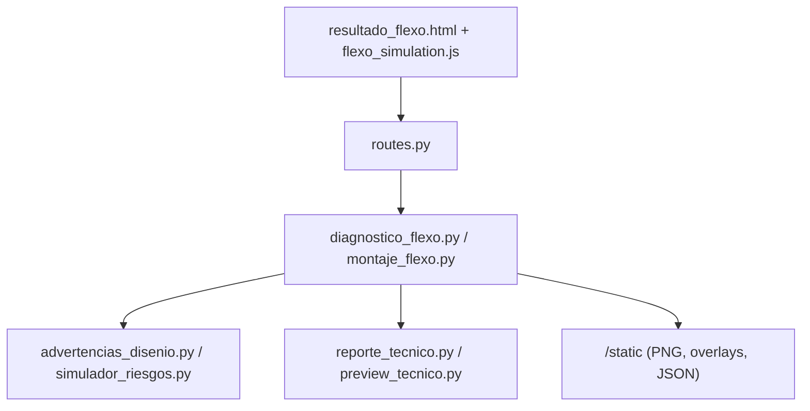
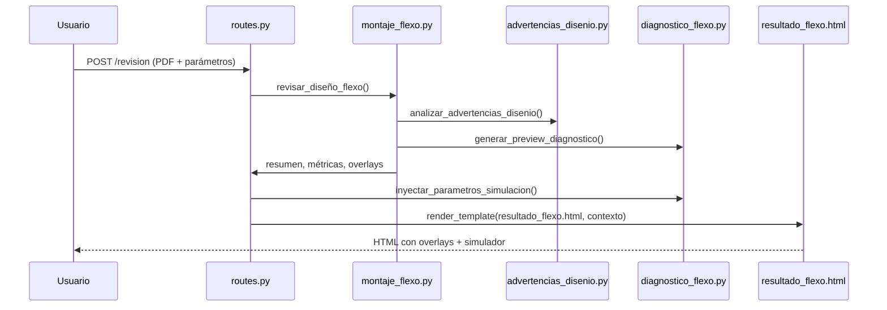

# Diagnóstico flexo – Mapa completo

## Mapa rápido

| Carpeta/Archivo | Rol en diagnóstico flexo | Principales funciones | Entrada → Salida |
| --- | --- | --- | --- |
| `diagnostico_flexo.py` | Núcleo de utilidades compartidas | `generar_preview_diagnostico`, `inyectar_parametros_simulacion`, `consolidar_advertencias` | PDF + advertencias → imágenes escaladas + JSON normalizado |
| `advertencias_disenio.py` | Reglas y bboxes | `verificar_textos_pequenos`, `verificar_lineas_finas_v2`, `revisar_sangrado`, `analizar_advertencias_disenio` | Texto/geom. PyMuPDF → advertencias HTML + overlays |
| `simulador_riesgos.py` | Clasifica riesgo | `simular_riesgos` | Resumen diagnóstico → tabla HTML por regla |
| `montaje_flexo.py` | Cobertura/TAC, preprocesos y reportes técnicos | `revisar_diseño_flexo` y auxiliares (`calcular_repeticiones_bobina`, `detectar_tramas_débiles`, etc.) | PDF + parámetros → métricas, advertencias, resúmenes |
| `flexo_config.py` | Umbrales centralizados por material/anilox | `get_flexo_thresholds`, `threshold_profiles` | Material/LPI → `FlexoThresholds` (pt, mm, TAC, dpi) |
| `routes.py` | Flask endpoints (revisión/resultados) | `/revision` y `/resultado` | Formulario + PDF → contexto Jinja/JSON persistente |
| `templates/resultado_flexo.html` | UI/overlays/simulador | Plantilla Jinja + scripts inline | Contexto Flask → HTML interactivo |
| `static/js/flexo_simulation.js` | Interacción simulador | `render`, `scheduleRender`, `handleExport` | Sliders/diagnóstico → canvas + métricas |
| `reporte_tecnico.py` | Reporte técnico descargable | `generar_reporte_tecnico`, `resumen_cobertura_tac` | Métricas dict → HTML resumen |
| `preview_tecnico.py` | Previews + overlays | `analizar_riesgos_pdf`, `generar_preview_tecnico` | PDF + advertencias → PNG + capas |
| `cobertura_utils.py` | Métricas CMYK/TAC | `calcular_metricas_cobertura` | PDF → stats CMYK/TAC |
| `tools/audit_flexo.py` | Auditoría automática | `run_checks`, `render_markdown` | Árbol repo → JSON/Markdown de hallazgos |
| `tests/test_diagnostico_flexo.py` | Tests de métricas y reglas | Casos límite de textos/trazos/TAC, coeficientes | Escenarios sintéticos → asserts |
| `tests/test_resultado_flexo_template.py` | Tests del template | Render mínimo, escalado JS | Contexto mínimo → HTML |

---

## 1. Estructura detallada (carpeta por carpeta)

### `diagnostico_flexo.py`
* **Responsabilidad:** utilidades transversales para el diagnóstico flexográfico (normalización de datos, carga de coeficientes de materiales, generación de previews y consolidación de advertencias).
* **Entradas/Salidas clave:**
  * `generar_preview_diagnostico(pdf_path, advertencias, dpi)` convierte la primera página del PDF en PNG base y PNG con iconos; reescala cada `bbox` de advertencias a píxeles (`bbox_pts * dpi/72`).
  * `inyectar_parametros_simulacion(diagnostico_json, parametros)` sincroniza claves nuevas (`anilox_lpi`, `anilox_bcm`, `paso_del_cilindro`, `velocidad_impresion`) con alias históricos (`lpi`, `bcm`, `paso`, `paso_cilindro`, `velocidad`).
  * `detectar_trama_debil_negro(img_cmyk, umbral)` analiza el canal K y crea advertencias sin `bbox` cuando hay tramas < umbral.
  * `consolidar_advertencias(*listas)` elimina duplicados por `(tipo|mensaje, bbox)`.
  * `resumen_advertencias`, `indicadores_advertencias`, `nivel_riesgo_global`, `semaforo_riesgo` sintetizan advertencias para UI y simulador.
* **Dependencias:** PyMuPDF (`fitz`), PIL, NumPy y Flask (`current_app`).
* **Dónde se usan:** `routes.py` (para generar previews y JSON persistido), `montaje_flexo.py` (filtro de objetos del sistema) y `tests/test_resultado_flexo_template.py` (mensaje por defecto de advertencias).

### `advertencias_disenio.py`
* **Responsabilidad:** inspeccionar la geometría/texto del PDF para detectar textos pequeños, líneas finas, modo de color incorrecto y elementos sin sangrado.
* **Funciones públicas:**
  * `verificar_textos_pequenos(contenido, thresholds)` recorre los `spans` de PyMuPDF; compara `size` vs `thresholds.min_text_pt` y crea overlays (`tipo="texto_pequeno"`).
  * `verificar_lineas_finas_v2(page, material, thresholds)` convierte anchos de trazo de puntos → mm (`width_pt / (72/25.4)`), compara con `thresholds.min_stroke_mm` y retorna HTML y overlays.
  * `verificar_modo_color(path_pdf)` analiza cada imagen embebida (`doc.extract_image`) para etiquetar RGB/Gray/otros.
  * `revisar_sangrado(page, sangrado_esperado, thresholds)` convierte márgenes de puntos a mm (`convertir_pts_a_mm`) y marca elementos a menos de `min_bleed_mm`.
  * `analizar_advertencias_disenio(path_pdf, material, pagina, contenido)` coordina todo, consolida overlays con `diagnostico_flexo.consolidar_advertencias`.
* **Dependencias:** `flexo_config.get_flexo_thresholds`, `utils.convertir_pts_a_mm`, PyMuPDF.

### `simulador_riesgos.py`
* **Responsabilidad:** transformar el resumen del diagnóstico (HTML/JSON) en una tabla de riesgos.
* **Funcionamiento:**
  * Convierte la entrada a texto minúsculas (`_a_texto`).
  * Aplica regex y comparaciones contra los umbrales de `FlexoThresholds` (`min_text_pt`, `min_stroke_mm`, `min_resolution_dpi`, `tac_warning`, `tac_critical`, `edge_distance_mm`, `min_bleed_mm`).
  * Produce filas `<tr>` con problema, nivel (emoji) y sugerencia.
* **Riesgo:** depende de frases en español; se mencionan en hallazgos los posibles falsos positivos/negativos.

### `montaje_flexo.py`
* **Responsabilidad:** pipeline completo del análisis flexo: limpieza de PDF, métricas de cobertura/TAC, detección de tramas débiles, Pantone, overprints, contraste, etc.
* **Submódulos clave:**
  * `corregir_sangrado_y_marcas` (genera PDF expandido si falta sangrado/marcas).
  * `verificar_resolucion_imagenes` (usa 300/600 dpi hardcodeados para fotos/line-art).
  * `detectar_capas_especiales` (spots, barnices, troqueles mediante PdfReader + regex).
  * `analizar_contraste` (usa `pdf2image` + OpenCV para evaluar percentiles 2/98).
  * `detectar_tramas_débiles` (convierte a CMYK, calcula stats por canal, integra con `diagnostico_flexo.detectar_trama_debil_negro`).
  * `detectar_overprints` y `_contar_overprints_pagina` (PyPDF2 para contar objetos con overprint).
  * `revisar_diseño_flexo` (función orquestadora invocada por `/revision`): construye `diseno_info`, `montaje_info`, `cobertura_info`, genera overlays, llama a `advertencias_disenio`, `cobertura_utils.calcular_metricas_cobertura`, `reporte_tecnico.resumen_cobertura_tac`, `simulador_riesgos.simular_riesgos`, etc.
* **Salidas:** HTML (listas de `<li>`), advertencias estructuradas (`advertencias_overlay`), métricas (dicts) y strings listos para el template/resultados JSON.

### `flexo_config.py`
* **Responsabilidad:** tabla de umbrales en un `dataclass` inmutable.
* **Detalles:**
  * `FlexoThresholds` define `min_text_pt=4.0`, `min_stroke_mm=0.20`, `min_bleed_mm=3.0`, `min_resolution_dpi=300`, `tac_warning=280`, `tac_critical=320`, `edge_distance_mm=2.0`.
  * `_PROFILE_OVERRIDES` aplica overrides por material (`film`, `papel`, `etiqueta_adhesiva`, `carton`).
  * `_ANILOX_RULES` permite ajustar por LPI (≥500, ≥600, ≥800).
  * `get_flexo_thresholds(material, anilox_lpi)` combina overrides; `threshold_profiles()` devuelve el mapa completo.

### `routes.py`
* **Responsabilidad:** Flask blueprint `routes_bp` con el flujo `GET/POST /revision` → `resultado_flexo.html` y `GET /resultado` para re-render.
* **Entradas/Sanitización:**
  * Valida PDF, tamaño máximo, material, parámetros de anilox/paso/velocidad.
  * Normaliza material con `utils.normalizar_material` y números con `_parse_parametro_float`.
* **Procesamiento:**
  * Llama a `revisar_diseño_flexo` → obtiene `resumen`, `texto`, `analisis_detallado`, `advertencias_overlay`.
  * Genera overlays (`preview_tecnico.analizar_riesgos_pdf`) y previews (`diagnostico_flexo.generar_preview_diagnostico`).
  * Construye `diagnostico_json` (claves históricas + nuevas) y lo enriquece con `inyectar_parametros_simulacion`.
  * Persiste `diag.json` y `res.json` en `static/uploads/<revision_id>` para re-render.
* **Salida a template:** `resultado_data` (resumen textual, rutas de imágenes, `advertencias_iconos`, `diagnostico_json`, indicadores, rutas base para la simulación y reporte técnico).

### `templates/resultado_flexo.html`
* **Responsabilidad:** interfaz de resultados.
* **Componentes:**
  * Sección de imagen analizada + overlay dinámico (`div#overlay-markers`).
  * Listas de advertencias (`#lista-advertencias`) y datos básicos (`#datos-basicos`).
  * Bloque de simulación avanzada con sliders y métricas (`#simulacion-avanzada`).
  * Scripts inline para generar overlays (`renderMarkers`) que calculan escala con `getBoundingClientRect` (se actualiza en `window.addEventListener('resize', ...)`).
  * Carga `static/js/flexo_simulation.js` y expone variables globales (`window.diagnosticoJson`, `window.materialCoefficients`, `window.revisionId`, etc.).

### `static/js/flexo_simulation.js`
* **Responsabilidad:** simulador interactivo.
* **Flujo:**
  * Obtiene canvas y sliders, determina `previewScaleFactor = devicePixelRatio * PREVIEW_PIXEL_SCALE`.
  * `render()` dibuja imagen base (si existe), aplica patrón halftone, actualiza métricas (`ml`, `tac`, `riesgo`), y sincroniza badges.
  * `handleExport()` llama al endpoint `/simulacion/exportar/<revision>` enviando JSON (`lpi`, `bcm`, `paso`, `velocidad`, `tacObjetivo`, `cobertura` por canal).
  * Incluye utilidades para parsear cobertura (`parseCoverageBase`), construir stats de advertencias y manejar caching de patrones.

### `reporte_tecnico.py`
* **Responsabilidad:** generar HTML descargable con tarjetas (`_card`) para cobertura/TAC, advertencias, recomendaciones por material.
* **Depende de:** `FlexoThresholds` (indirecto via `montaje_flexo`), plantillas HTML en strings.

### `preview_tecnico.py`
* **Responsabilidad:** crear PNGs base y overlays para el reporte técnico.
* **Puntos clave:**
  * `analizar_riesgos_pdf(path_pdf, advertencias)` reescala `bbox` similares a `generar_preview_diagnostico` y guarda overlay en `static/previews`.
  * `generar_preview_tecnico(...)` combina previews, estadísticas y recomendaciones para el HTML final.

### `cobertura_utils.py`
* **Responsabilidad:** cálculo de cobertura y TAC usando PyMuPDF en CMYK y RGB.
* **Salida:** dict con `cobertura_promedio`, `cobertura_por_area`, `cobertura_total`, `tac_p95`, `tac_max`.
* **Uso:** `montaje_flexo.revisar_diseño_flexo` y tests.

### `tools/audit_flexo.py`
* **Responsabilidad:** analizar el repo para detectar hardcodes, lógica duplicada, keys inconsistentes y escalados legacy.
* **Salida:** JSON (default) o Markdown.
* **Uso sugerido:** `python tools/audit_flexo.py --format markdown`.

### `tests/…`
* `tests/test_diagnostico_flexo.py`: cobertura, advertencias, configuraciones flexibles, límites de umbrales, TAC.
* `tests/test_resultado_flexo_template.py`: asegura mensajes por defecto, presencia de scripts y (nuevo) escalado de overlays.

---

## 2. Umbrales: origen y uso

| Regla | Valor por defecto | Unidad | Dónde se aplica | Consumidores |
| --- | --- | --- | --- | --- |
| Texto mínimo | 4.0 | pt | `advertencias_disenio.verificar_textos_pequenos`; `simulador_riesgos.simular_riesgos`; tests | `routes.revisar` (vía `analizar_advertencias_disenio`), simulador JS (stats), reportes |
| Trazo mínimo | 0.20 | mm | `advertencias_disenio.verificar_lineas_finas_v2`; `simulador_riesgos` (convierte pt→mm) | Diagnóstico backend, tabla de riesgos |
| Sangrado mínimo | 3.0 | mm | `advertencias_disenio.revisar_sangrado`; `simulador_riesgos` (mensaje “Sin sangrado”) | Overlays y advertencias HTML |
| Distancia a borde | 2.0 | mm | Regex en `simulador_riesgos` (“Elementos < edge_distance_mm mm”) | Simulador de riesgos |
| Resolución mínima | 300 (600 line-art) | dpi | `verificar_resolucion_imagenes` (hardcode + hallazgo); `simulador_riesgos` | HTML de riesgos, reporte técnico |
| TAC advertencia | 280 | % | `simulador_riesgos` (rango medio), `montaje_flexo` (mensajes de cobertura), reportes | Tabla de riesgos, `revisar_diseño_flexo` |
| TAC crítico | 320 | % | `simulador_riesgos` (riesgo alto) | Tabla de riesgos |
| Trama débil negro | 5 | % (valor relativo, configurable en llamada) | `diagnostico_flexo.detectar_trama_debil_negro`, `montaje_flexo.detectar_tramas_débiles` | Indicadores y advertencias |

Los overrides por material/anilox se cargan al llamar `get_flexo_thresholds(material, anilox_lpi)` desde `advertencias_disenio` y `simulador_riesgos`.

---

## 3. Flujo extremo a extremo

### Arquitectura de módulos



### Secuencia de request (POST `/revision` → render de resultado)



### Flujo de datos de bboxes/coords

```mermaid
graph LR
    PDF[PDF (pt)] -->|PyMuPDF| BBoxPt[Lista bbox en pt]
    BBoxPt -->|convertir_pts_a_mm| BBoxMM[mm]
    BBoxPt -->|scale = dpi/72| BBoxPX[píxeles]
    BBoxPX -->|Canvas scaling (flexo_simulation.js)| OverlayUI[overlay HTML/CSS]
    BBoxPX -->|preview_tecnico| PNGOverlay
```

* Backend genera `bbox` en puntos (unidad PDF).
* Conversión a mm se usa en advertencias y reportes (`convertir_pts_a_mm`).
* `generar_preview_diagnostico` y `preview_tecnico.analizar_riesgos_pdf` multiplican por `dpi/72` → píxeles.
* El template mide `getBoundingClientRect()` para escalar iconos según tamaño en pantalla.

---

## 4. Contratos de datos

### JSON enviado al template (`diagnostico_json`)

| Clave | Tipo | Origen | Obligatoria | Descripción |
| --- | --- | --- | --- | --- |
| `archivo` | str | Nombre PDF (`secure_filename`) | Sí | Archivo procesado |
| `pdf_path` | str | Ruta relativa en `/static/uploads` | Sí | Para descargas |
| `cobertura` | dict/None | Letras generadas (`cobertura_letras`) | No | Cobertura por canal en texto |
| `cobertura_por_canal` | dict/None | `calcular_metricas_cobertura` (shadow) | No | % por canal, normalizado (preferido en v2) |
| `cobertura_total` | float/None | Métrica TAC | No | Cobertura total |
| `tac_total_v2` | float/None | Suma CMYK (`calcular_metricas_cobertura`) | No | TAC preferido cuando `USE_PIPELINE_V2` está activo |
| `tac_p95`, `tac_max` | float/None | Percentiles TAC | No | Percentil 95 y máximo del TAC |
| `cobertura_estimada` | float/None | Alias legado (rellenado desde TAC) | No | Compatibilidad (deprecado) |
| `tac_total` | float/None | Alias legado (shadow mode completa si falta) | No | Compatibilidad (deprecado) |
| `cobertura_base_sum` | float/None | Alias legado para TAC | No | Compatibilidad con JS previo (deprecado) |
| `tinta_ml_min` | float/None | `tinta_utils.calcular_transmision_tinta` | No | Flujo global de tinta (ml/min) en pipeline v2 |
| `tinta_por_canal_ml_min` | dict/None | `tinta_utils.calcular_transmision_tinta` | No | Flujo por canal (ml/min) alineado con simulador |
| `anilox_lpi` (`lpi`) | int | Formulario → `inyectar_parametros_simulacion` | Sí | Lineatura |
| `anilox_bcm` (`bcm`) | float | Formulario | Sí | Volumen |
| `paso`, `paso_cilindro`, `paso_del_cilindro` | float | Formulario | Sí | Paso de cilindro |
| `material` | str | Formulario normalizado | Sí | Nombre normalizado |
| `coef_material` | float | `coeficiente_material` | No | Coeficiente de absorción |
| `velocidad_impresion` (`velocidad`) | float | Formulario | Sí | m/min |
| `ancho_mm`, `alto_mm` | float | `obtener_info_basica` | Sí | Tamaño diseño |
| `ancho_util_m` | float | Conversión mm → m | No | Lado útil |
| `advertencias_resumen` | str | `resumen_advertencias` | No | Texto resumen |
| `indicadores_advertencias` | dict | `indicadores_advertencias` | Sí | Totales por tipo |
| `advertencias_total`, `conteo_tramas`, `conteo_overprint` | int | Derivados de indicadores | Sí | Stats resumidos |
| `tiene_tramas_debiles`, `tiene_overprint`, `tiene_texto_pequeno` | bool | Indicadores | Sí | Flags |

**Nota:** el backend (`montaje_flexo.py` → `routes.py`) genera un único `diagnostico_json` consumido directamente por la plantilla y `static/js/flexo_simulation.js`; no hay cálculos duplicados cuando `USE_PIPELINE_V2=True`.

### Contexto adicional al template

* `resumen`: HTML de `revisar_diseño_flexo`.
* `tabla_riesgos`: tabla de `simulador_riesgos`.
* `advertencias_iconos`: lista de dicts `[{tipo, bbox/pos, mensaje}]`.
* `material_coefficients`: mapa completo (`coeficiente_material` + JSON de data/material_coefficients.json).
* `material_coeficiente`: coeficiente final usado.
* `sim_img_web`, `diag_base_web`, `diag_img_web`: rutas en `/static/previews`.
* `indicadores_advertencias`, `advertencias_resumen`: se envían duplicados para fallback.
* `USE_PIPELINE_V2`: flag booleano que habilita shadow mode de métricas TAC en el front.

---

## 5. Unidades y conversiones

| Conversión | Implementación | Uso |
| --- | --- | --- |
| pt → mm | `utils.convertir_pts_a_mm(valor)` | Sangrado, márgenes, reportes |
| pt → px | `scale = dpi / 72` dentro de `generar_preview_diagnostico` y `preview_tecnico.analizar_riesgos_pdf` | Overlays PNG |
| mm → repeticiones | `calcular_repeticiones_bobina` (alto diseño vs paso cilindro) | Información de montaje |
| TAC (%) | `sum(coberturas)` y percentiles en `cobertura_utils` | Mensajes de cobertura, simulador |
| Escalado UI | `getBoundingClientRect` + `clientWidth`/`naturalWidth` en JS | Posicionar iconos y canvas |

*El simulador usa `devicePixelRatio` para evitar desenfoque en pantallas retina y `PREVIEW_PIXEL_SCALE` (0.28) para reducir carga gráfica.*

---

## 6. Glosario

* **LPI (Lines Per Inch):** lineatura del anilox; mayor LPI permite textos/tramas más finos.
* **BCM (cm³/m²):** volumen de celda del anilox; influye en carga de tinta.
* **TAC (Total Area Coverage):** suma porcentual de CMYK en un punto; límites dependen de material.
* **Trama débil:** áreas con valores muy bajos de tinta en un canal (especialmente negro) susceptibles de perderse.
* **Sobreimpresión (overprint):** impresión de un elemento sin generar knock-out; útil para blancos/varnish pero riesgo en elementos críticos.
* **Sangrado:** extensión del diseño más allá del corte para evitar bordes blancos.
* **Paso del cilindro:** perímetro útil del cilindro impresor, determina cuántas repeticiones del diseño entran.
* **Coeficiente de material:** factor experimental para simulaciones (absorción/transmisión).

### FAQ técnica

1. **¿Por qué se renderiza solo la primera página?** `revisar_diseño_flexo` y `generar_preview_diagnostico` abren `doc[0]`. Para soportar múltiples páginas se necesitarían bucles y overlays por página.
2. **¿Cómo se calculan los colores CMYK?** PyMuPDF renderiza la página en `csCMYK`, se descartan píxeles casi blancos (`mask_white`) antes de promediar.
3. **¿Dónde se actualizan los umbrales por material?** `get_flexo_thresholds(material_norm)` se invoca en `advertencias_disenio` y `simulador_riesgos`; al cambiar `flexo_config.py` los valores se reflejan en ambos.
4. **¿Qué pasa si falla Poppler/pdf2image?** `detectar_tramas_débiles` atrapa excepciones y marca advertencias genéricas; se documenta en hallazgos la necesidad de logging.
5. **¿Cómo reutiliza la simulación los resultados previos?** `inyectar_parametros_simulacion` conserva alias y se persisten `diag.json`/`res.json` para recargar la vista `/resultado`.

---

## 7. Cómo ejecutar y probar rápido

1. **Entorno:** `pip install -r requirements.txt` (requiere poppler para `pdf2image` y OpenCV).
2. **Servidor Flask:** `flask --app app.py run` (usa `routes_bp`).
3. **Comandos útiles:**
   * `python tools/audit_flexo.py --format markdown` → informe de hardcodes/keys.
   * `pytest -k flexo` → ejecuta pruebas focalizadas.
4. **Datos de ejemplo:** cargar un PDF en `static/uploads` o usar `data/ejemplos` (si se agrega).

Variables relevantes:
* `OPENAI_API_KEY` (opcional) para sugerencias IA en `montaje_flexo`.
* `MAX_CONTENT_LENGTH` en config Flask (control tamaño PDF).

---

## 8. Checklist previo a merge

- [ ] ¿Los umbrales modificados se declararon en `flexo_config.py` y no están hardcodeados en otros módulos?
- [ ] ¿Los nuevos campos JSON fueron añadidos tanto en `routes.py` como en `templates/resultado_flexo.html` y `static/js/flexo_simulation.js`?
- [ ] ¿`USE_PIPELINE_V2` está documentado y probado en off/on y la UI tolera `tac_total_v2=None`?
- [ ] ¿Se actualizaron/crearon tests en `tests/test_diagnostico_flexo.py` para nuevos límites?
- [ ] ¿`tools/audit_flexo.py` sigue pasando sin hallazgos críticos inesperados?
- [ ] ¿Los overlays renderizados coinciden con los `bbox` esperados (ver prueba `test_preview_bbox_scaling_exact`)?
- [ ] ¿La documentación (`DOCS/*.md`) refleja las rutas/umbrales actuales?

---

## 9. Próximos pasos sugeridos

Ver `DOCS/HALLAZGOS_DIAG_FLEXO.md` para la auditoría detallada y plan de mejoras por fases.

